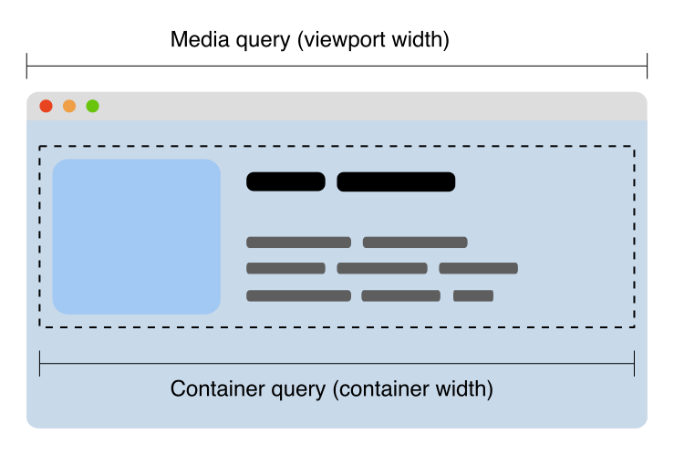

# CSS Container Queries

* CSS Containment
  * 페이지의 일부를 분리하고 이러한 부분이 스타일 및 레이아웃 측면에서 페이지의 나머지 부분과 독립적임을 브라우저에 선언하는 방법을 제공&#x20;
*   반응형 디자인을 만드는 경우 미디어 쿼리를 사용해 뷰포트를 사용해 뷰포트 크기에 따라 페이지 레이아웃을 변경하는 경우가 많음&#x20;

    * 페이지에서 사용 가능한 공간에 따라 특정 레이아웃이 있는 재사용 가능한 구성 요소로 HTML 요소를 그룹화하는 것이 일반적&#x20;
    * 사용 가능한 공간은 뷰포트의 크기뿐만 아니라 구성 요소가 나타나는 컨텍스트에 따라 달라질 수 있음&#x20;

<figure><figcaption></figcaption></figure>

* Container Query를 사용하면 컨테이너 크기를 보고 Viewport 또는 기타 장치 특성이 아닌 컨테이너 크기에 따라 콘텐츠에 스타일을 적용할 수 있음&#x20;
* 컨테이너 주변 컨텍스트의 공간이 적은 경우&#x20;
* ex) 특정 요소를 숨기거나 더 작은 글꼴을 사용할 수 있음&#x20;

<figure><figcaption></figcaption></figure>

#### Container Queries를 사용하기&#x20;

* 컨테이너 쿼리를 사용하려면 브라우저가 나중에 이 컨테이너의 차원을 쿼리할 수 있음을 알 수 있도록&#x20;
  * 요소에 containment context를 선언해야 함&#x20;
  * 이렇게 하려면, container-type 속성에 size, inline-size 또는 normal 값을 사용함&#x20;

* [https://developer.mozilla.org/en-US/docs/Web/CSS/CSS\_Container\_Queries](https://developer.mozilla.org/en-US/docs/Web/CSS/CSS\_Container\_Queries)
