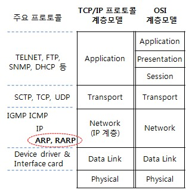

# ARP

* 논리적인 IP 주소를 (망계층), 물리적인 MAC 주소로 (데이터링크 계층) 바꾸어주는 역할을 하는 주소 해석 프로토콜&#x20;

#### 라우터 상의 ARP 동작의 예

* ARP 요청&#x20;
  * 만일 이전에 전혀 통신한 경험이 없는 LAN(서브네트워크)의 라우터에 외부로부터 데이터 패킷이 전달되어 목적지 호스트를 찾을 때&#x20;
  * 라우터가 최초로 하는 일은 ARP Request Packet(ARP 요청 패킷)을 LAN의 전체 노드에 송출 (Broadcast)
  * 이때, ARP 요청 메시지에는&#x20;
    * 송신자 자신의 MAC 주소 및 IP 주소, 목적지 IP 주소를 채우지만,&#x20;
    * 목적지의 MAC 주소는 0으로 채워넣음&#x20;

*   ARP 응답&#x20;

    * ARP 요청 패킷에 포함된 IP 주소와 일치하는 Host는 자신의 IP 주소 및 물리주소를 채워놓은 ARP Reply Packet(ARP 응답패킷)을 해당 라우터에게 송출함으로써(유니캐스트),&#x20;
    * 물리 주소 및 IP 주소 상호간의 관련 정보를 얻게됨&#x20;

#### ARP Cache (ARP 캐쉬 테이블, ARP 테이블)

* ARP 캐쉬를 최신으로 유지&#x20;
  * 각 노드(node)는 ARP의 효율적 수행을 위해 ARP 캐쉬를 최신으로 유지하는 일이 필수&#x20;
  * 캐쉬의 각 항목은 새로이 생긴 후로 20분이 지나면 자동적으로 소멸 (RFC 1122)
  * 따라서, 자주 사용되는 곳은 ARP cache를 통해 즉각적으로 조회가 가능&#x20;
* ARP 트래픽 경감&#x20;
  * 만약 ARP cache에 조회되는 자료가 없는 경우에만 ARP Request Packet (ARP 요청 패킷)을 송출하게 되어 전체적으로 LAN 트래픽을 경감시킴&#x20;

#### ARP 패킷 포맷 및 계층 구성&#x20;

<figure><figcaption></figcaption></figure>

#### 참고 사항&#x20;

* PPP와 같은 점대점 링크에선 ARP가 사용되지 않음&#x20;
  * PPP가 브로드캐스트 형 인터페이스가 아니므로 ARP가 적용되지 않음&#x20;
* ARP 패킷은 3계층(네트워크계층)을 통해 타 네트워크로 넘어갈 수 없음&#x20;
* Proxy ARP
* Gratuitous ARP
* RARP(Reverse Address Resolution Protocol)

[http://www.ktword.co.kr/test/view/view.php?m\_temp1=2188\&id=421](http://www.ktword.co.kr/test/view/view.php?m\_temp1=2188\&id=421)

* [http://www.ktword.co.kr/test/view/view.php?m\_temp1=10](http://www.ktword.co.kr/test/view/view.php?m\_temp1=10)
