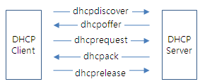

# DHCP Message Type

* [http://www.ktword.co.kr/test/view/view.php?m\_temp1=5419\&id=1244](http://www.ktword.co.kr/test/view/view.php?m\_temp1=5419\&id=1244)

#### DHCP 메시지 타입&#x20;

* DHCPDISCOVER - 탐색&#x20;
  * 클라이언트가 서버를 찾기위해 브로드캐스팅하는 메시지&#x20;
* DHCPOFFER - 제안&#x20;
  * 서버가 클라이언트에게 할당 후보 IP 주소 제시&#x20;
* DHCPREQUEST - 요청&#x20;
  * 서버를 선택한 클라이언트가 원하는 구성 요청&#x20;
  * 후보로 제시된 IP 주소의 사용을 요청&#x20;
  * IP 주소의 유효기간 연장을 요청&#x20;
* DHCPDECLINE
  * 이미 사용중인 중복 주소임을 알고서 거부함 (요청 수락 거부)
* DHCPACK - 요청 수락&#x20;
  * 긍정 응답
* DHCPNACK - 요청 거부&#x20;
  * 부정 응답, 클라이언트의 요청 사항을 서버가 거부&#x20;
* DHCPRELEASE&#x20;
  * 클라이언트가 정상적인 해제를 서버에게 요청&#x20;
  * 일반적으로, 클라이언트는 그냥 전원을 끄므로, 후에 다시금 DHCPREQUEST로써 유효기간 연장 요청&#x20;
* DHCPINFORM
  * 클라이언트가 주소 정보 이외 추가 설정 정보를 얻기 위해 사용&#x20;
  * 즉, 주소 설정 정보 이외의 추가 정보의 요청&#x20;
* DHCPFORCERENEW
* DHCPLEASEQUERY
* DHCPLEADUNASSIGNED
* DHCPLEASEUNKNOWN
* DHCPLEASEACTIVE

<figure><figcaption></figcaption></figure>

#### DHCPDISCOVER - 탐색&#x20;

* 처음에 클라이언트가 DHCP 서버를 탐색하는 브로드캐스트 메시지&#x20;
  * 출발지 IP 주소 : 0.0.0.0
  * 목적지 IP 주소 : 255.255.255.255 (브로드캐스트)
* DHCP 메세지 포맷 내 필드&#x20;
  * op 필드&#x20;
    * 1 (client -> server)&#x20;
    * 요청 BOOTREQUEST
  * flags 필드&#x20;
    * Broadcast
    * \`1000 0000 0000 0000\`
  * xid 필드&#x20;
    * 클라이언트가 선택하는 랜덤한 32비트짜리 수&#x20;
    * 요청 및 응답을 짝짓는데 사용&#x20;
  * ciaddr 필드&#x20;
    * Zero IP Address 값을 써넣음&#x20;
    * 아직 미확정이므로 편의상 0.0.0.0
  * chaddr 필드
    * 자신의 MAC 주소를 써넣음&#x20;

#### DHCPOFFER - 제안&#x20;

* 클라이언트 DHCPDISCOVER 메시지에 서버가 할당 후보 IP 주소를 제시/응답하는 메시지&#x20;
  * 출발지 IP 주소 : DHCP 서버의 IP 주소&#x20;
  * 목적지 IP 주소 : 255.255.255.255 - 브로드캐스트&#x20;
* DHCP 메세지 포맷 내 필드&#x20;
  * op 필드&#x20;
    * 2 (server -> client)&#x20;
    * 요청 BOOTREPLY
  * flags 필드&#x20;
    * Broadcast
    * \`1000 0000 0000 0000\`
  * yiaddr&#x20;
    * Your IP Address (4 바이트)
    * 클라이언트에 할당 IP 주소를 제시/제안&#x20;
  * giaddr
    * Gateway IP Address (4 바이트)
    * 디폴트 게이트웨이 주소&#x20;
  * options
    * 임대 기간 : DHCP Lease Time

#### DHCPREQUEST - 요청&#x20;

* 클라이언트가 DHCP 서버에게 자신이 사용할 구성정보의 내역을 알려주며 요청&#x20;
  * 출발지 IP 주소 : 0.0.0.0
  * 목적지 IP 주소 : 255.255.255.255 (브로드캐스트)
* DHCP 메시지 포맷 내 필드&#x20;
  * op 필드&#x20;
    * 1 (client -> server)&#x20;
    * 요청 BOOTREQUEST
  * flags 필드&#x20;
    * Broadcast
    * \`1000 0000 0000 0000\`
  * siaddr : 클라이언트가 선택한 DHCP 서버의 IP 주소&#x20;
  * ciaddr : 클라이언트 자신이 사용하려는 IP 주소&#x20;
  *   xid : 클라이언트가 선택하는 랜덤한 32비트짜리 수&#x20;

      * 요청 및 응답을 짝짓는데 사용&#x20;

#### DHCPACK - 요청 수락&#x20;

* DHCP 서버가 클라이언트 자신이 사용할 구성정보 제안에 대한 수락 메시지&#x20;
  * 출발지 IP 주소 : DHCP 서버의 IP 주소&#x20;
  * 목적지 IP 주소 : 255.255.255.255 (브로드캐스트)
* DHCP 메시지 포맷 내 필드&#x20;
  * op 필드&#x20;
    * 2 (server -> client)
    * 응답 BOOTREPLY
  * flags 필드&#x20;
    * Broadcast
    * \`1000 0000 0000 0000\`
  * xid&#x20;
    * 클라이언트가 선택한 랜덤한 32비트짜리 수&#x20;
    * 요청 및 응답을 짝짓는데 사용&#x20;
  * yiaddress : Your IP Address
  * options

