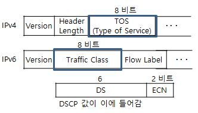
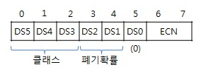

# DSCP

* IP 헤더에 붙는, DiffServ 모델에 따른 서비스품질 유형을 나타내는 표식&#x20;
  * 패킷이 받을 서비스의 종류 또는 등급을 나타냄&#x20;
  * 모든 IP 헤더에 붙이게 됨 (6비트)
    * 홉 단위 동작(PHB)을 구분하는 의미를 지님&#x20;

<figure><figcaption></figcaption></figure>

*   DSCP 정의 형태&#x20;

    <figure><figcaption></figcaption></figure>

* DSCP 값 : 64개 코드 포인트 2^6 = 64
  * 우선순위 클래스 (3비트)
    * 000값 : 일반 최선 노력 인터넷 트래픽&#x20;
    * 000 (보통: 우선순위 낮음) \~ 111 (네트워크 제어: 우선순위 높음)
  * 카테고리(그룹) 구분&#x20;
    * (xxxxx0) : 표준
    * (xxxx11) : 실험용/로컬
    * (xxxx01) : 실험용/예약
  *
