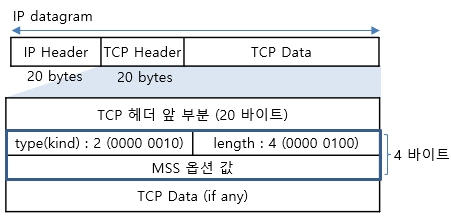

# MSS

* TCP 최대 세그먼트 크기, TCP MSS 옵션&#x20;

#### TCP 최대 세그먼트 크기&#x20;

* TCP 세그먼트 크기?
  * IP 헤더, TCP 헤더를 제외하고, TCP가 실을 수 있는 데이터만의 크기를 의미&#x20;
* TCP MSS&#x20;
  * TCP가 TCP 세그먼트 1개로 보낼 수 있는 최대 데이터 크기를 말함&#x20;
    * 기본값(Default) : IPv4 - 536바이트, IPv6 - 1220바이트
* MSS vs MTU 크기 비교
  * MTU : (IP 기반의 정보) IP 헤더, TCP 헤더, TCP 데이터를 모두 포함하는 길이&#x20;
  * MSS : (TCP 기반의 정보) 단지 TCP 데이터(페이로드) 길이 만을 의미&#x20;
* TCP MSS 값의 전달&#x20;
  * TCP 헤더 옵션에 포함시켜 그 값을 전달&#x20;

#### TCP - MSS 옵션 값의 통보/협상&#x20;

* TCP 연결설정 시에 통보/협상&#x20;
  * TCP 연결설정을 위한 초기 세그먼트(SYN 세그먼트)를 전송할 때
    * 초기 세그먼트에 MSS 옵션에 그 값을 포함시켜 전달함&#x20;
  * SYN 제어비트(TCP 제어 플래그)가 설정된 상태에서
    * 처음 왕복하는 2개의 세그먼트(SYN 세그먼트, SYN+ACK 세그먼트)에서만 나타남&#x20;
    * 이것이 추후에 나타나면 이를 무시&#x20;
* TCP는 양방향이므로,
  * 참여 양단 호스트별로(각 방향으로) 다른 MSS값이 사용됨&#x20;
  * 즉, 연결에 참여하는 두 장비가 서로 다른 MSS값을 가질 수도 있음&#x20;

#### MSS 옵션 값의 미지정(기본), 지정(명시), 기타값

* 미지정(기본)하는 경우 = (소량 데이터인 경우)
  * 기본 MSS 옵션 값 : 536바이트(IPv4)
    * 즉, 미 지정시 기본값 536 바이트가 사용됨&#x20;
* 지정(명시)하며 전달하는 경우 = (대량 데이터인 경우)
  * TCP 연결설정  시에, 양 끝단 TCP 장치들 간에 자신이 속한 네트워크의 MTU 값에서 40바이트(IP 헤더, TCP 헤더를 합친 개략치)를 뺀 값을 통보&#x20;
  * 고속 컴퓨터(큰 MSS 요구)와 저속 컴퓨터(작은 MSS 요구) 간의 협상으로 볼 수 있음&#x20;
* 기타&#x20;
  * 값 65535 : 무한 크기 값(주로, IPv6의 점보그램에 사용됨)
    * 그 한계는, PMTU에서 60 바이트(IPv6 헤더 40 + TCP 헤더 20)를 뺀 값&#x20;
  * 값 1460 : 이더넷 경우의 전형적인 값 (이더넷 MTU 1500 - IPv4 헤더 20 - TCP 헤더 20)

#### MSS 옵션 필드 구성&#x20;

<figure><figcaption></figcaption></figure>

* 옵션 길이 : 총 32비트 (4바이트)
  * type (1 바이트) : Maximum Segment Size(MSS) 옵션임을 알림(=2)
  * length (1 바이트) : MSS 옵션이 차지하는 총 길이(크기)를 말함 )(=4)
  * value (2 바이트) : MSS 값&#x20;

[http://www.ktword.co.kr/test/view/view.php?m\_temp1=836](http://www.ktword.co.kr/test/view/view.php?m\_temp1=836)
