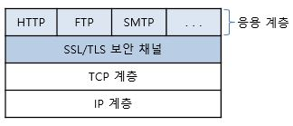
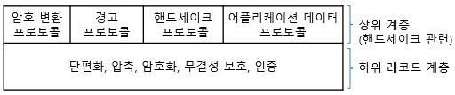

# SSL/TLS

* 전송계층 상에서 클라이언트, 서버에 대한 인증 및 데이터 암호화 수행&#x20;
  * 클라이언트와 서버 양단 간 응용계층 및 TCP 전송계층 사이에서&#x20;
  * 안전한 보안 채널을 형성해 주는 역할을 하는, 보안용 프로토콜&#x20;

* HTTP(HTTPS), FTP(FTPS), TELNET, SMTP, SIP, POP, IMAP 등에서 사용 가능&#x20;
* 주로, 웹 브라우저와 웹 서버 사이의 안전한 보안 채널을 제공하기 위해 많이 사용됨&#x20;

* 오픈 소스 구현 : OpenSSL

#### SSL/TLS의 특징&#x20;

* 클라이언트/서버 기반의 프로토콜&#x20;
  * 클라이언트/서버 두 응용 상대방 간에, 연결 전 동적 협상에 의한 보안 연결 수립&#x20;
* 응용 프로그램(어플리케이션) 자체 구현 가능&#x20;
  * 대부분 다른 보안 프로토콜(EAP, IPsec 등)은 운영체제 등에 밀접하게 관련됨
* 계층 위치&#x20;
  * 응용계층 및 전송계층 사이에 위치하나, 전송계층과 보다 밀접하게 동작함
  * 소켓 지향적인 프로토콜&#x20;
* 운반용 프로토콜 및 포트번호&#x20;
  * 운반용 프로토콜 : TCP 또는 UDP
  * 사용 포트 : 응용 마다 다름&#x20;
    * HTTPS의 경우에, HTTP를 위한 SSL/TLS 보안 터널 형성을 위해, 포트번호 443을 사용&#x20;
* 인증 구조 : X.509
  * X.509에서 규정된 공개키 인증서 교환에 의해 상대방에 대한 인증 수행&#x20;
* 키 교환 방식 : 협상 선택 가능&#x20;
  * Null, RSA 공개 키 교환, Anonymous Diffie-Hellman 키 교환, Ephermeral Diffie-Hellman 키 교환, Fixed Diffie-Hellman 키 교환, Fortezza&#x20;
* 대칭키 암호화 방식 : 협상 선택 가능&#x20;
  * RC2, RC4, RC4, DES, Triple DES, IDEA 등&#x20;
* 해쉬 알고리즘 : 협상 선택 가능&#x20;
  * Null, MD5, SHA-1

#### SSL/TLS의 주요 기능&#x20;

* 상호 인증&#x20;
  * 공개키 인증서를 이용해 서버, 클라이언트의 상호 인증&#x20;
  * 즉, 클라이언트/서버 두 응용 간에 상대방에 대한 인증&#x20;
* 메시지 인증 (메시지 무결성)
  * 메시지 인증 코드 HMAC에 의한 메시지 무결성 제공&#x20;
* 메시지 압축&#x20;
  * 디폴트는 Null
    * 압축 알고리즘은 미리 정해지지 않고 협상으로 지정 가능&#x20;
* 암호화용 세션 키 생성(대칭 키 합의)을 위한 키 교환&#x20;
  * RSA : 두 키(공개 키 및 개인 키)가 하나의 수 체계를 형성 (서버 공개 키 사용)
  * Diffie-Hellman : Diffie-Hellman 프로토콜을 기반으로 한 키 교환 방식&#x20;
* 생성된 공유 비밀키에 의해 암호화된 종단간 안전한 연결 통로 제공&#x20;
  * 스트림 암호화 : 40, 128 비트의 RC4
  * 블록 암호화 : IDEA, 40, 56 비트의 DES, 168비트의 3DES 등&#x20;

#### SSL/TLS의 프로토콜 스택&#x20;

*   전송계층 TCP 위에서, '보안 소켓/보안 채널/터널링'을 구성&#x20;

    <figure><figcaption></figcaption></figure>
* 응용계층에서 생성된 데이터에 대한 보안(인증, 무결성, 기밀성), 압축 등의 서비스 제공&#x20;

* SSL/TLS의 상세 프로토콜 스택&#x20;

<figure><figcaption></figcaption></figure>

* 크게, 상위 핸드세이크 관련 프로토콜과 하위 레코드 프로토콜(단편화, 압축, 무결성, 암호화, 인증  기능  제공)들로 구성됨&#x20;

[http://www.ktword.co.kr/test/view/view.php?m\_temp1=1957](http://www.ktword.co.kr/test/view/view.php?m\_temp1=1957)
