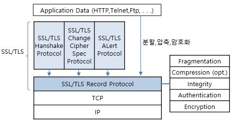
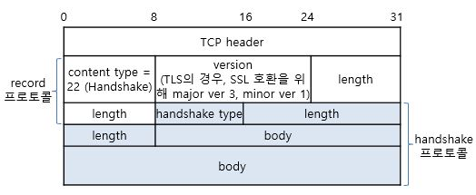
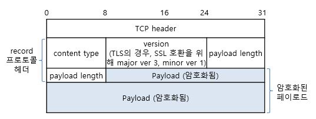

# SSL/TLS Protocols

#### SSL/TLS 프로토콜 스택&#x20;

<figure><figcaption></figcaption></figure>

* 크게, 두 그룹으로 구성&#x20;
  * 상위 핸드세이크 관련 프로토콜들&#x20;
  * 하위 레코드 프로토콜 (단편화, 압축, 무결성, 암호화 기능 제공)

#### SSL/TLS 핸드세이크 프로토콜&#x20;

<figure><figcaption></figcaption></figure>

* Application 데이터의 교환 이전의 세션 초기화 중에 이루어짐
  * 서버와 클라이언트가 상호 인증&#x20;
  * 암호 키 교환 및 암호화 알고리즘 협상 및 확립을 도모하기 위한 정보 교환&#x20;
  * DES 알고리즘 등에 기반하여 세션키를 생성&#x20;

* 주요 협상 내용&#x20;
  * 키 교환 방식 협상&#x20;
  * 암호화 방식 협상&#x20;
  * HMAC 방식 협상&#x20;
  * 압축 방식 협상&#x20;

*   클라이언트/서버 간에 공유 암호 키를 만들기 위해

    * "데이터 암호화"를 위한 공유 암호 키를 정의 함&#x20;
    * "메시지 인증"을 위한 메시지 인증 코드(TLS: HMAC 코드) 생성&#x20;

*   메시지 종류(Handshake Type)

    * Hello request (0)
    * Client Hello (1) (클라이언트 => 서버)
      * 주요 정보 : Version, Client Random Number, Session ID, Cipher Suite, Compression Method&#x20;
      * Cipher Suite
        * 클라이언트가 지원 가능한 보안 방식들을 2바이트 코드 값으로 열거한 것&#x20;
        * 키 교환 방식, 암호화 방식, MAC 코드 방식&#x20;
    * Server Hello (2) (서버  => 클라이언트)
      * 주요 정보 : Version, Server Random Number, Session ID, Selected Cipher Set, Selected Compression Method&#x20;
    * Certificate (11) : 서버, 클라이언트가 송신하는 X.509 v3 인증서가 이에 수납됨&#x20;
    * Server Key Exchange (12)
    * Certificate Request (13)
    * Server Hello Done (14)
    * Certificate Verify (15)
    * Client Key Exchange (16)
    * Finished (20)

#### Change Cipher Spec 프로토콜&#x20;

* 상호 암호 통신을 위한&#x20;
  * 일련의 보안 알고리즘 정보의 결정과&#x20;
  * 일련의 보안 매개변수(암호학적 비밀)를 상대에게 신속하게 전송하는 데 사용&#x20;
* 또한, 현재 작동되고 있는 보안 매개변수를 변경하기 위함&#x20;

#### &#x20;Alert 프로토콜&#x20;

* 핸드세이크 과정에서&#x20;
  * 상대방이 제시한 암호화 방식을 지원할 수 없을 때 등의 경우에,
  * 즉, 오류 발생 시 상대방에게 오류 통보 기능 수행&#x20;

#### Record 프로토콜 (또는 데이터 교환 프로토콜)

* 특징&#x20;
  * 상위 프로토콜인 핸드세이크, Change Cipher Spec, Alert 프로토콜 등의 제어 메시지와 Application 메세지들을 수납하여&#x20;
  * 레코드 단위(TLS record)로 운반하면서,&#x20;
  * 분할, 압축, 무결성, 인증, 암호화 등의 기능을 레코드 단위로 제공하는 프로토콜&#x20;
* 주요 기능&#x20;
  * 메시지 분할 (Fragmentation)
    * 2^14 또는 그 이하의 블록으로 데이터를 나눔&#x20;
  * 메시지 압축(Compression)
  * 메시지 무결성(Message Integrity)
  * 메시지 인증(Message Authentication)
  * 메시지 암호화(Encryption)
* 계층 위치&#x20;
  * TCP 전송계층 바로 위에 위치&#x20;
    * 양단간 통신 연결 시 보안 제공&#x20;
* 제공 보안서비스: 기밀성, 무결성&#x20;
  * 기밀성 : DES 등과 같은 암호화 방식을 선택하여 이를 이용하여 보안성을 제공&#x20;
  * 무결성 : 매 메시지별 HMAC 이용&#x20;

* 프로토콜 구성&#x20;

<figure><figcaption></figcaption></figure>

* 필드 구성 : 4개로 구성&#x20;
  * type field, version field, length field, fragment field&#x20;
* 상위 메시지 종류 (content type)
  * Change Cipher Spec 프로토콜 (20)
  * Alert 프로토콜 (21)
  * Handshake 프로토콜 (22)
  * Application Data (23)

