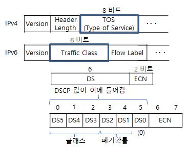
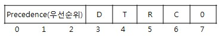

# TOS

* TOS 또는 Traffic Class 필드&#x20;
  * IP 패킷 헤더 내 '서비스 유형' 및 '혼잡 알림'을 나타내는 8비트 필드&#x20;

* IP 헤더 내 형태&#x20;
  * IPv4 : Type Of Service 필드
  * IPv6 : Traffic Class 필드

<figure><figcaption></figcaption></figure>

* Type Of Service(TOS) Flag (8 bits)

<figure><figcaption></figcaption></figure>

* 우선순위 설정용&#x20;
  * Bit 0-2 : Precedence  (우선순위  8단계)
    * 000 : Routine (Normal)
    * 001 : Priority
    * 010 : Immediate&#x20;
    * 011 : Flash
    * 100 : Flash Override&#x20;
    * 101 : Critical
    * 110 : Internetwork Control (OSPF에서 셋팅됨)
    * 111 : Network Control&#x20;
* TOS 설정용&#x20;
  * Bit 3 : Delay (지연)
    * 0 : 보통의 지연, 1 : 높은 지연&#x20;
  * Bit 4 : Throughput (처리율)
    * 0 : 보통 처리율, 1 : 높은 처리율&#x20;
  * Bit 5 : Reliability (신뢰성)&#x20;
    * 0 : 보통 신뢰성, 1: 높은 신뢰성&#x20;
  * Bit 6 : Minimum Cost (최소비용)
* 사용안함&#x20;
  * Bit 7 : 항상 0으로 설정됨&#x20;

#### Traffic Class 필드 (8비트)

* (DS 필드 6비트 + ECN 필드 2비트 = 총 8비트)
  * DS 필드 : 요구되는 서비스 질에 대한 유형을 나타내는데 사용&#x20;
    * IP 데이터그램이 라우터에서 어떻게 처리되어야 하는지를 정의&#x20;
  * ECN 필드 : 혼잡 알림을 위해 사용&#x20;
    * 라우터가 패킷을 즉각 폐기하지 않고, 최종 노드에게 혼잡을 알리는 용도&#x20;
* DS(Differentiated Service, 차등  서비스) 필드&#x20;
  * DSCP 값 : 64개 코드 포인트&#x20;
    * .0 값 : 일반 최선 노력 인터넷 트래픽 (기본값)
  * 카테고리 구분&#x20;
    * .1 (xxxxx0) : 표준&#x20;
    * .2 (xxx11) : 실험용/로컬&#x20;
    * .3 (xxx.01) : 실험용/예약&#x20;
* ECN(Explicit Congestion Notification, 명시적 혼잡 알림) 필드&#x20;
  * 00 : 패킷이 ECN 기능을 사용하지 않음&#x20;
  * 01 또는 10 : 발신측에서 중단점이 ECN 기능을 수용함을 나타냄&#x20;
    * 11 : 라우터가 혼잡이 발생했음을 알리고자 하는 표식

