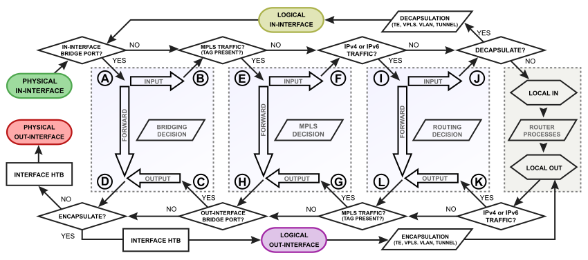
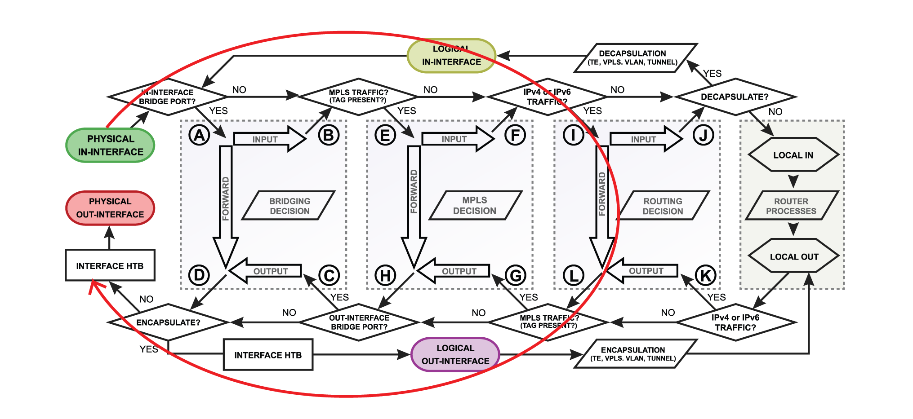
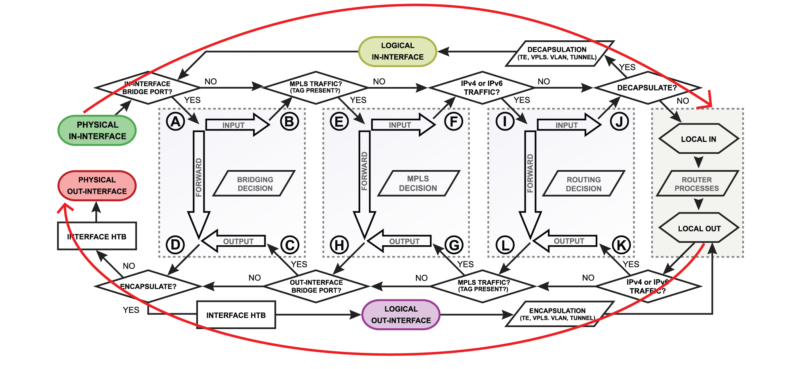

# Packet Flow in RouterOS

#### 패킷 흐름 이해&#x20;

* 하나 이상의 RouterOS 시설을 활용해야 하는 트래픽 우선순위 지정, 라우팅 정책과 같은 고급 방화벽 설정 or 복잡한 작업엔 지식이 필요&#x20;

<figure><figcaption></figcaption></figure>

*   다이어그램 중앙엔, Bridging, Routing, MPLS 결정, 로컬 router process의 4개 상자가 있음&#x20;

    * ex) 패킷이 라우터를 통해 라우팅되어야 하는 경우

    <figure><figcaption></figcaption></figure>

    * 각 facility를 자세히 살펴보지 않고 패킷이 in-interface로 들어가고 라우터는 그것이 IP 트래픽이고 라우팅이 필요하다고 판단 & 패킷은 모든 라우팅 프로세스를 거쳐 out-interface를 나감&#x20;

<figure><figcaption></figcaption></figure>

* 패킷의 목적지가 라우터인 경우,
  * in-interface는 ICMP(Ping) 패킷을 수신하고 목적지는 라우터 자체&#x20;
  * 패킷은 local-in 처리를 위해 이동함&#x20;
  * 패킷이 처리된 후 라우터 내부에서 ICMP(ping) 응답이 생성되고(로컬 출력 처리) 외부 인터페이스를 통해 전송됨&#x20;

* [https://help.mikrotik.com/docs/display/ROS/Packet+Flow+in+RouterOS](https://help.mikrotik.com/docs/display/ROS/Packet+Flow+in+RouterOS)
