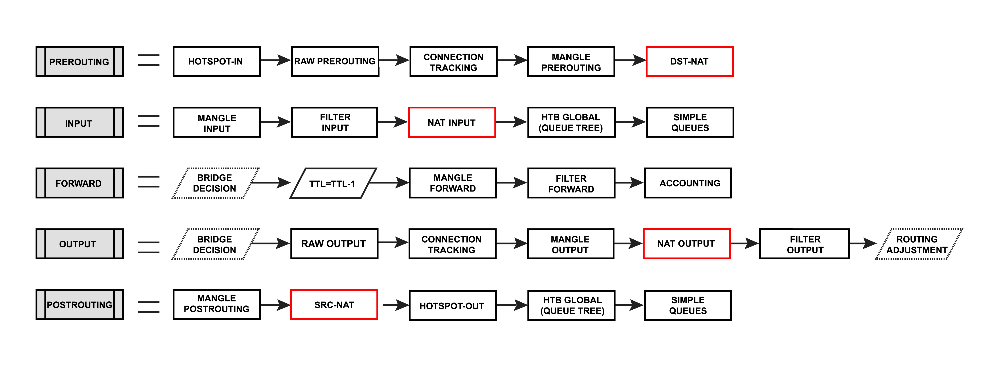
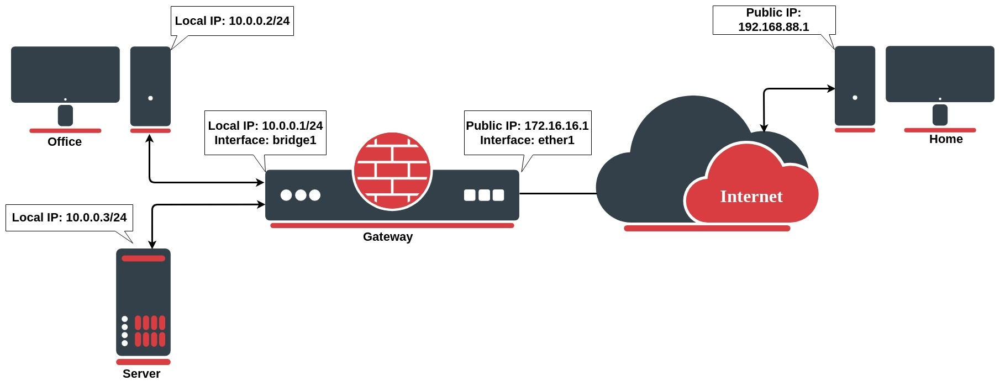
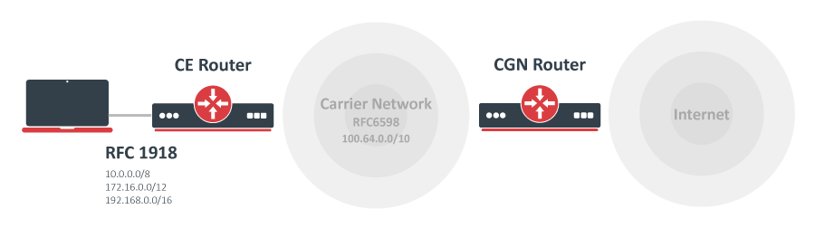

# NAT


* 로컬 영역 네트워크의 호스트가 내부 통신용 IP 주소 집합과 외부 통신용 IP 주소 집합을 사용할 수 있도록 하는 인터넷 표준&#x20;
* NAT를 사용하는 LAN은 natted 네트워크로 간주됨&#x20;
  * NAT가 작동하려면 각 Natted 네트워크에 NAT 게이트웨이가 있어야 함&#x20;


* NAT 게이트웨이(NAT 라우터)
  * 패킷이 LAN에서 이동하는 도중에 IP 주소 재작성을 수행함&#x20;


* NAT는 연결의 첫 번째 패킷만 일치시키고 연결 추적은 작업을 기억하고 동일한 연결에 속하는 다른 모든 패킷에 대해 수행

주의!

* NAT 규칙이 변경되거나 추가될 때마다 연결 추적 테이블을 지워야 함&#x20;
  * Connection tracking table 관리 필수&#x20;
* 연결 항목이 만료될 때까지 NAT 규칙이 올바르게 작동하지 않는 것처럼 보일 수 있음&#x20;



#### SNAT(Source NAT)

* natted 네트워크에서 생성된 패킷에서 수행됨&#x20;
* NAT 라우터는 라우터를 통과할 때 IP 패킷의 개인 소스 주소를 새 공용 IP주소로 바꿈&#x20;
* 다른 방향으로 이동하는 응답 패킷에는 역동작이 적용됨&#x20;

#### DNAT(Destination NAT)

* natted 네트워크로 향하는 패킷에서 수행됨&#x20;
* 인터넷에서 액세스할 수 있도록 개인 네트워크의 호스트를 만드는 데 가장 일반적으로 사용됨&#x20;
* DSTNAT를 수행하는 NAT 라우터는 라우터를 통해 사설 네트워크로 이동할 때 IP 패킷의 대상 IP 주소를 대체함&#x20;

RouterOS v7부터 방화벽 NAT에는 로컬 시스템에서 실행되는 애플리케이션으로 전달되고 전송되는 패킷을 통과하는 두 개의 새로운 INPUT, OUTPUT 체인이 있음&#x20;

#### INPUT

* 라우터의 주소 중 하나인 대상 IP 주소가 있는 인터페이스 중 하나를 통해 라우터에 들어오는 패킷을 처리하는 데 사용됨&#x20;
* 라우터를 통과하는 패킷은 입력 체인의 규칙에 따라 처리되지 않음&#x20;

#### OUTPUT

* 라우터에서 시작된 패킷을 처리하고 인터페이스 중 하나를 통해 나가는 데 사용됨&#x20;
* 라우터를 통과하는 패킷은 출력 체인의 규칙에 따라 처리되지 않음&#x20;

### Destination NAT

<figure><figcaption></figcaption></figure>

* 네트워크 주소 변환은 패킷 IP 헤더의 네트워크 주소 정보를 수정하여 작동&#x20;
* ex) 네트워크 관리자가 인터넷에서 사무실 서버에 액세스하려는 일반적인 설정&#x20;
  * 인터넷에서 로컬 IP가 10.0.0.3인 사무실 서버로의 연결을 허용하려고 함&#x20;
  * 사무실 게이트웨이 라우터에서 대상 주소 변환 규칙을 구성해야 함&#x20;


```bash
/ip firewall nat add chain=dstnat action=dst-nat dst-address=172.16.16.1 dst-port=22 to-address=10.0.0.3 protocol=tcp 
```

* 들어오는 연결이 대상 주소가 172.16.16.1인 TCP 포트 22를 요청하면&#x20;
  * dst-nat 작업을 사용하고 패킷을 로컬 IP 주소 10.0.0.3 및 포트 22를 가진 장치로 보냄&#x20;


* 집에 있는 PC에서만 액세스를 허용하려면 집 PC 공개 IP 주소인 src-address=192.168.88.1로 dst-nat 규칙을 개선할 수 있음 (더 안전한 것으로 간주됨)

### Source NAT

* ISP에서 받은 공용 IP 주소 뒤에 로컬 장치를 숨기려면 MikroTik 라우터의 source network address 기능을 구성해야 함&#x20;
* 공용 IP 172.16.16.1 뒤에 사무실 컴퓨터, 서버를 모두 숨기고 싶다면?

```bash
/ip firewall nat add chain=srcnat src-address=10.0.0.0/24 action=src-nat to-address=172.16.16.1 out-interface=WAN
```

* ISP는 IP 172.16.16.1로 오는 모든 요청을 볼 수 있으며, LAN 네트워크 IP 주소는 볼 수 없음&#x20;

#### Masquerade&#x20;

* Firewall NAT action=masquerade
* action=srcnat의 고유한 하위 버전 & 공용 IP가 무작위로 변경될 수 있는 상황에서 특정 용도로 설계됨&#x20;
* 공용 IP는 동적&#x20;

```bash
/ip firewall nat add chain=srcnat src-address=10.0.0.0/24 action=masquerade out-interface=WAN
```

* 인터페이스 연결이 끊기거나 해당 IP 주소가 변경될 때마다 라우터는 인터페이스와 관련된 masqueraded된 연결 추적 항목을 모두 지움&#x20;
  * 공용 IP 변경 후 시스템 복구 시간이 단축됨&#x20;
  * Masquerade 대신 srcnat를 사용하면 연결 추적 항목이 남아 있고 링크 실패 후 연결을 다시 시작할 수 있음&#x20;


* 안타깝게도 기본 링크가 다운된 후 연결이 다른 링크를 통해 라우팅될 때, 불안정한 링크에 몇 가지 문제가 발생할 수 있음&#x20;
  * 연결 해제 시, 모든 관련 연결 추적 항목이 제거될 수 있음&#x20;
  * 제거된(이전에 masqueraded된) 모든 연결의 다음 패킷은 새 것으로 방화벽에 들어오고, 기본 인터페이스가 돌아오지 않으면 패킷이 대체 경로(있는 경우)를 통해 라우팅되므로 새 masquerade 연결이 생성됨&#x20;
  * 기본 링크가 다시 돌아오고 라우팅이 기본 링크를 통해 복원되므로 기존 연결에 속하는 패킷이 masquerade되지 않고 기본 인터페이스를 통해 전송됨&#x20;
    * 로컬 IP가 공용 네트워크로 노출됨&#x20;
    * 이 상황을 해결하기 위해 연결 해제 시 사라질 수 있는 경로 대신&#x20;
      * blackhole 경로를 생성할 수 있음&#x20;


* NAT 지원 라우터 뒤에 있는 호스트는 진정한 종단 간 연결이 없음&#x20;
  * 따라서, 일부 인터넷 프로토콜은 NAT 시나리오에서 작동하지 않을 수 있음&#x20;
  * Private 네트워크 외부에서 TCP 연결을 시작해야 하거나 UDP와 같은 상태 비저장 프로토콜이 필요한 서비스는 중단될 수 있음&#x20;
  * 이러한 제한을 극복하기 위해 RouterOS에는 다양한 프로토콜에 대한 NAT 통과를 가능하게 하는&#x20;
    * 소위 NAT 헬퍼가 많이 포함되어 있음&#x20;
    * 대신, action=srcnat를 사용하면 연결 추적 항목이 유지되고 연결을 다시 시작할 수 있음&#x20;

#### Source NAT vs Masquerading&#x20;

* 하나의 주소 공간을 다른 주소 공간에 매핑하는 동일한 기본 기능을 수행하지만 세부 사항은 약간 다름&#x20;
* 가장 눈에 띄는 점&#x20;
  * masquerading이 패킷이 종료되는 인터페이스에 바인딩된 IP에서 OutBound 패킷의 Source IP 주소를 선택한다는 것&#x20;

### CGNAT(NAT444)

<figure><figcaption></figcaption></figure>

### Hairpin NAT

<figure><figcaption></figcaption></figure>


[https://help.mikrotik.com/docs/display/ROS/NAT](https://help.mikrotik.com/docs/display/ROS/NAT)


