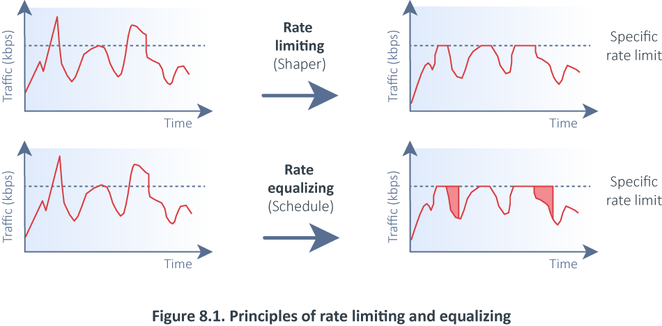
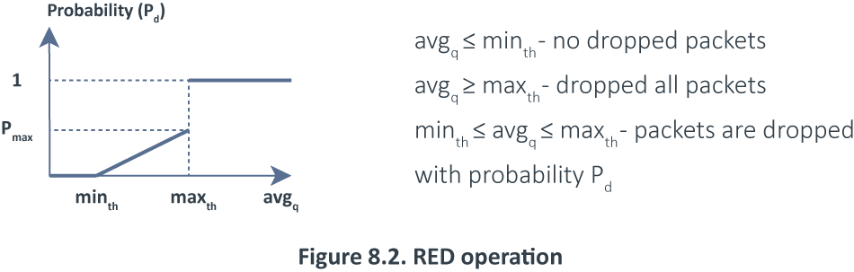
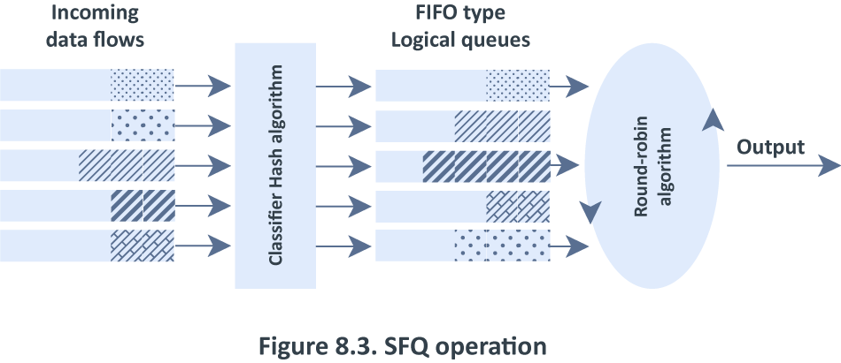
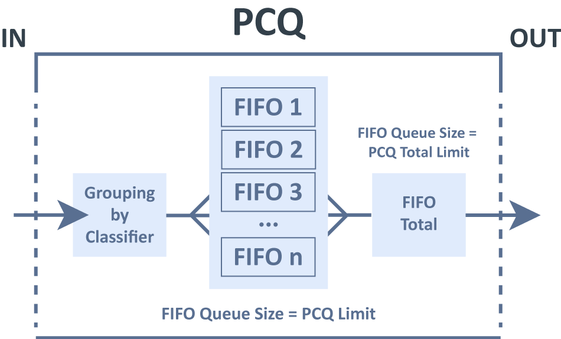

# Index

* Queu는 미리 정의된 구조 방법론을 사용하여, 네트워크 장치에서 전송하기를 집합적으로 기다리는 데이터 패킷의 모음&#x20;
* Queuing은 은행이나, 슈퍼마켓에서 사용되는 것과 동일한 방법으로 작동하며, 고객은 도착순서에 따라 처리됩니다.&#x20;

#### Queue의 예시&#x20;

* 특정 IP 주소, 서브넷, 프로토콜, 포트 등에 대한 데이터 속도 제한&#x20;
* peer-to-peer 트래픽 제한&#x20;
* 패킷 우선순위&#x20;
* traffic 가속을 위해 traffic 버스트를 구성&#x20;
* 다른 시간 기반 제한을 적용
* 사용자 간에 사용 가능한 트래픽을 균등하게 또는 채널 부하에 따라 공유&#x20;

\------

* MikroTik RouterOS의 Queue 구현은 HTB(계층적 토큰 버킷)을 기반으로 함&#x20;
* HTB를 사용하면 계층적 대기열 구조를 생성하고 대기열 간의 관계를 결정할 수 있음&#x20;
  * 이러한 계층 구조는 서로 다른 두 위치에 연결될 수 있음&#x20;

* RouterOS에서 대기열을 구성하는 방법에는 두 가지가 있음&#x20;
  * `/queue simple` menu&#x20;
    * 단순하고 매일 대기하는 작업을 쉽게 구성하도록 설계됨&#x20;
    * ex) 단일 클라이언트 업로드/다운로드 제한, p2p 트래픽 제한 등
  * `/queue tree` menu
    * 고급 대기열 작업을 구현하기 위한 것&#x20;
    * ex) 전역 우선 순위 지정 정책, 사용자 그룹 제한&#x20;
    * /ip firewall mangle 기능에서 표시된 패킷 흐름이 필요함&#x20;

#### Rate limitation principles (속도 제한 원칙)

* 속도 제한은 네트워크 인터페이스에서 보내거나 받는 트래픽 흐름의 속도를 제어하는 데 사용됨&#x20;
* 지정된 속도보다 작거나 같은 속도의 트래픽은 전송되고, 그 속도를 초과하는 트래픽은 삭제되거나 지연됨&#x20;
* 두 가지 방법으로 수행할 수 있음&#x20;

#### 1. 속도 제한을 초과하는 모든 패킷 폐기

* 속도 제한(Dropper or Shaper)
* queue 크기가 0일 때, 100% 속도 제한&#x20;

#### 2. Queue의 특정 속도 제한을 초과하는 패킷을 지연하고 가능한 경우 전송&#x20;

* 속도 균등화(Scheduler)
* queue 크기가 무제한인 경우, 100% 속도 균등화&#x20;

<figure><figcaption></figcaption></figure>

* 1번째 경우&#x20;
  * 모든 트래픽이 특정 속도를 초과하고 삭제됨&#x20;
* 또 다른 경우
  * 트래픽이 특정 속도를 초과하여 Queue에서 지원되고 가능한 경우 나중에 전송되지만 패킷은 Queue가 가득 차지 않을 때까지만 지연될 수 있음&#x20;
  * Queue Buffer에 더 이상 공간이 없으면 패킷이 삭제됨&#x20;

* 각 Queue에 대해 두 가지 속도 제한을 정의할 수 있음&#x20;
  * CIR(Committed Information Rate)
    * RouterOS에서 limit-at&#x20;
    * 최악의 경우 흐름은 다른 트래픽 흐름에 관계없이 이 양의 트래픽 속도를 얻음&#x20;
    * 주어진 시간에 대역폭은 이 약정 속도 아래로 떨어지지 않아야 함&#x20;
  * MIR(Maximum Information Rate)
    * RouterOS의 최대 제한&#x20;
    * 최상의 경우 시나리오, 대역폭의 여유 부분이 있는 경우 흐름에 사용할 수 잇는 최대 데이터 속도&#x20;

#### Simple Queue&#x20;

* Simple Queue는 특정 대상에 대한 트래픽을 제한하는 일반적인 방법&#x20;
* Simple Queue를 사용해 고급 QoS 애플리케이션을 구축할 수 있음&#x20;
* ex)
  * peer-to-peer traffic Queueing&#x20;
  * 선택한 시간 간격으로 Queue 규칙을 적용
  * 우선순위&#x20;
  * `/ip firewall mangle` 의 여러 패킷 표시 사용&#x20;
  *   양방향 트래픽의 트래픽 셰이핑(스케줄링)(업로드+다운로드 합계에 대해 1개 제한)

<figure><figcaption></figcaption></figure>

#### Queue Tree&#x20;

* HTB 중 하나에 단방향 queue만 생성함&#x20;
* 별도의 인터페이스에 Queue를 추가하는 유일한 방법&#x20;
  * Mangle 구성 쉽게 가능&#x20;
* 다운로드 및 업로드에 별도의 표시가 필요하지 않음&#x20;
  * 업로드만 공개 인터페이스에 도달하고 다운로드만 비공개 인터페이스에 도달함&#x20;
* Simple Queue와의 주요 차이점은 Queue tree가 정렬되지 않는다는 것&#x20;
* 즉, 모든 트래픽이 함께 전달됨&#x20;

Queue 종류&#x20;

* 패킷 처리 알고리즘&#x20;
* 라인에서 다음으로 전송될 패킷을 설명&#x20;
* RouterOS에선
  * FIFO(BFIFO, PFIFO, MQ PFIFO)
  * RED / SFQ / PCQ

#### FIFO

* First-In-First-Out을 기반으로 함&#x20;
* PFIFO, BFIFO의 차이점은 하나는 패킷 단위로 측정되고 다른 하나는 바이트 단위로 측정된다는 것&#x20;
* 이러한 Queue들은 pfifo-limit, bfifo-limit 매개변수를 사용함&#x20;
* Queue에 넣을 수 없는 모든 패킷은 삭제됨&#x20;
  * 대기열이 가득 찬 경우&#x20;
  * 큰 Queue의 크기는 대기 시간을 증가시킬 수 있지만, 채널을 더 잘 활용함&#x20;

* MQ-PFIFO는 다중 전송 큐를 지원하는 pfifo
  * 다중 전송 대기열을 지원하고 Linux 드라이버가 다중 전송 대기열을 지원하는 이더넷 인터페이스가 있는 SMP 시스템에서 유

#### RED(Random Early Drop)

* 평균 Queue 크기를 제어하여 네트워크 정체를 피하려는 대기열 메커니즘&#x20;
* 평균 대기열 크기는 최소 및 최대 임계값의 두 임계값과 비교됨&#x20;
* avgq(평균 대기열 크기)가 최소 임계값보다 작으면 패킷이 삭제되지 않음&#x20;
  * 평균 대기열 크기가 최대 임계값보다 크면 들어오는 모든 패킷이 삭제됨&#x20;
* But, 평균 대기열 크기가 최소 임계값과 최대 임계값 사이에 있으면 확률 Pd로 패킷이 무작위로 삭제됨&#x20;
*   확률 : 평균 대기열 크기의 함수&#x20;

    * Pd = Pmax(avgq - minth) / (maxth-minth)
    * 평균 대기열이 커지면 들어오는 패킷을 삭제할 확률도 높아짐
    * Pmax - 패킷 폐기 확률, 갑작스러움을 조정할 수 있는 비율&#x20;

    <figure><figcaption></figcaption></figure>

#### SFQ

* Stochastic Fairness Queuing (SFQ)&#x20;
  * 해싱 및 round robin 알고리즘을 통해 보장됨&#x20;
* 실제로 각 흐름에 대해 Queue를 할당하지 않기 때문에 Stochastic이라고 함
* 해싱 알고리즘을 사용하여 제한된 수의 대기열(1024개)로 트래픽을 나누는 알고리즘&#x20;
*   트래픽 흐름은 4가지 옵션

    * src-address, dst-address, src-port, dst-port으로 고유하게 식별될 수 있음

    <figure><figcaption></figcaption></figure>

#### PCQ&#x20;

* 매우 간단, 처음에는 선택한 분류기를 사용하여 하나의 하위 스트림을 다른 하위 스트림과 구별한 다음&#x20;
  * 모든 하위 스트림에 개별 FIFO 대기열 크기 및 제한을 적용한 다음&#x20;
  * 다음 모든 하위 스트림을 함께 그룹화하고 전역 대기열 크기 및 제한을 적용함&#x20;

<figure><figcaption></figcaption></figure>

* [https://help.mikrotik.com/docs/display/ROS/Queues](https://help.mikrotik.com/docs/display/ROS/Queues)
