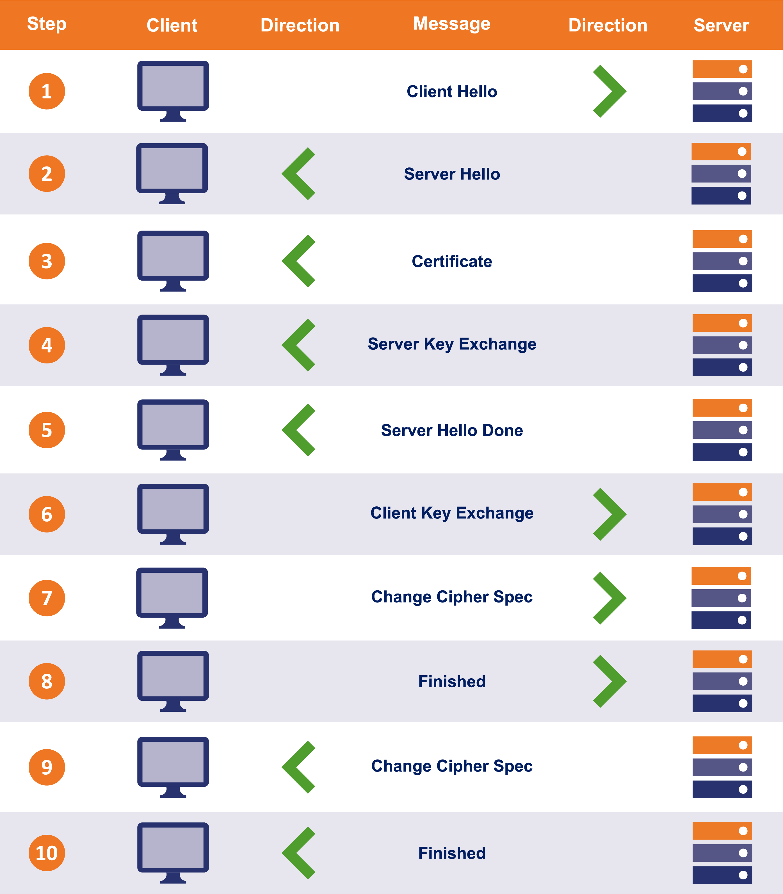

# Closer Look at the SSL/TLS Handshake

* [https://www.thesslstore.com/blog/explaining-ssl-handshake/](https://www.thesslstore.com/blog/explaining-ssl-handshake/)
*
* SSL/TLS 인증서는 HTTPS를 통해 웹사이트를 제공하는 데 필요&#x20;
  * 핸드셰이크 => 각 연결이 시작되고 SSL/TLS의 기술 기반이 구축되는 곳&#x20;

* HTTPS 연결에는 클라이언트(연결을 시작하는 사람, 일반적으로 웹 브라우저)와 서버의 두 당사자가 관련됨&#x20;
* SSL/TLS Handshake의 목적은 보안 연결에 필요한 모든 암호화 작업을 수행하는 것&#x20;
  * 사용중인 SSL인증서 인증 및 암호화 키 생성이 포함&#x20;

*   TLS Handshake는 3가지 주요 작업을 수행&#x20;

    * 암호화 제품군 및 매개변수 교환&#x20;
    * 한쪽 또는 양쪽 모두 인증&#x20;
    * 대칭 세션 키 생성/교환&#x20;

#### 암호 제품군(Cipher Suites) 협상&#x20;

* 모든 SW는 다름&#x20;
* 웹 브라우저는 가장 일반적인 클라이언트
* 마찬가지로 서버측에서도 Windows Server, Apache, NGINX와 같은 널리 사용되는 OS는 모두 매우 다른 기능을 지원&#x20;
* 사용자 지정 구성을 추가하면 훨씬 더 복잡&#x20;
* 첫 번째 단계!
  * 클라이언트와 서버가 상호 지원하는 암호화 기능을 찾을 수 있도록 기능을 공유해야 함&#x20;
  * 클라이언트와 서버가 사용할 정확한 암호화 방법(암호 모음)에 동의하면 서버는 클라이언트에 SSL 인증서를 보냄&#x20;

#### 인증&#x20;

* 클라이언트는 인증서를 받으면 인증서가 진짜인지 확인함&#x20;
* 매우 중요한 단계&#x20;
* 진정으로 안전한 연결을 유지하려면 데이터만 암호화할 수 없음&#x20;
  * 데이터가 올바른 웹사이트/조직으로 전송되고 있음을 알아야 함&#x20;

* 신뢰할 수 있는 모든 SSL 인증서는 디지털 인증서 발급을 승인받은 회사인 인증 기관(CA)에서 발급함&#x20;
  * 이러한 조직은 발급하는 인증서를 계속 신뢰할 수 있도록 발급 및 유효성 검사에 대한 엄격한 지침을 따라야 함&#x20;
  * 진정으로 소유한 웹사이트 또는 회사에 대한 인증서만 받을 수 있도록 하기 위한 것&#x20;
  * CA는 일종의 공증인이라고 생각할 수 있음&#x20;
  * 서명은 인증서의 엔터티가 그것이 누구인지를 나타냄&#x20;

* TLS 핸드셰이크의 인증 부분 동안 클라이언트는 서버에서 제공한 인증서가 인증되었는지 확인하기 위해 몇 가지 암호화된 보안 검사를 수행함&#x20;
  * 디지털 서명을 확인하고 인증서가 신뢰할 수 있는 CA에서 온 것인지 확인하는 것이 포함&#x20;

* 이 단계에서 클라이언트는 서버가 인증서와 연결된 개인 키를 소유하고 있는지도 확인&#x20;
  * 모든 SSL 인증서에는 공개 키와 개인 키로 구성된 쌍이 포함되어 있음&#x20;
  * 공개 키는 데이터를 암호화하는 데 사용되고 개인 키는 해독하는 데 사용됨&#x20;
* 두 기능이 서로 다른 키에 의해 수행되기 때문에 이를 "비대칭" 공개 키 암호화라고 함&#x20;
  * 암호화는 사실상 단방향&#x20;

* 가장 일반적인 공개키 암호화 시스템인 RSA를 사용하면 클라이언트는 세션 키를 생성하는 데 필요한 공개 키로 임의의 데이터를 암호화함&#x20;
  * 서버는 소유 증명을 제공하는 개인 키가 있는 경우에만 해당 데이터를 해독하고 사용할 수 있음&#x20;

* ECC와 같은 다른 유형의 암호 시스템이 사용되는 경우 이 프로세스가 변경되지만, 소유 증명은 항상 확인됨&#x20;

#### 키 교환&#x20;

* TLS 핸드셰이크의 마지막 부분, 보안 통신에 실제로 사용될 키인 "세션 키" 생성과 관련됨&#x20;
* 세션 키는 "대칭"
  * 즉, 동일한 키가 암호화 및 암호 해독에 사용됨&#x20;
  * 이러한 키는 비대칭 키보다 훨씬 효율적으로 강력한 암호화를 달성할 수 있으므로&#x20;
  * HTTPS 연결에서 데이터를 주고받는 데 적합&#x20;
* Key를 생성하는 정확한 방법&#x20;
  * 선택한 암호 그룹에 따라 다르며 가장 일반적인 체계는 RSA와 Diffie-Hellman

* Handshake를 끝내기 위해 각 당사자는 필요한 모든 작업을 완료했음을 상대방에게 알린 다음
  * 두 사람 모두 체크섬을 실행하여 악의적인 조작이나 손상없이 handshake가 발생했는지 확인&#x20;

* 전체 SSL 핸드셰이크는 수백 밀리초 내에 발생하며 모두 배후에 있음&#x20;
  * 웹 페이지 로딩 이전에도 HTTPS 연결에서 가장 먼저 발생해야 하는 일&#x20;

* SSL 핸드셰이크가 완료되면 암호화되고 인증된 HTTPS 연결이 시작되고 사용자와 서버 간에 송수신되는 모든 데이터가 보호됨&#x20;

* TLSv1.3까지는 사이트를 다시 방문할 때마다 HandShake가 다시 발생&#x20;
  * TLSv1.3 Handshake는 0 RTT 또는 제로 왕복 시간 재개를 지원하여 재방문자의 속도를 크게 높임&#x20;
* 이전에는 많은 서버가 효율성과 속도를 위해 "Resumption" 프로세스를 구현했지만 0 RTT는 이를 11로 바꿈?

#### the TLS 1.2 HandShake: Step by Step&#x20;

<figure><figcaption></figcaption></figure>

* 각 TLS 핸드셰이크에는 암호화 기능 교환, SSL 인증서 인증, 세션 키 교환/생성 을 수행하는 일련의 단계가 포함&#x20;

1. 첫 번째 메시지 : "Client Hello"
   1. 서버가 둘이 통신하는 데 사용할 암호화 제품군을 선택할 수 있도록 클라이언트의 기능을 나열&#x20;
   2. 또한, 클라이언트 랜덤 이라고 하는 무작위로 선택된 큰 소수도 포함됨&#x20;
2. 서버는 "Server Hello" 메시지로 정중하게 응답함&#x20;
   1. 이 메시지에서 클라이언트에게 제공된 목록에서 선택한 연결 매개변수를 알려주고&#x20;
   2. "Server Random"라고 하는 임의로 선택된 소수를 반환&#x20;
   3. 클라이언트와 서버가 공통 기능을 공유하지 않으면 연결이 성공적으로 종료되지 않음&#x20;
3. "Certificate" 메시지에서 서버는 SSL 인증서 체인(leaf, 중간 인증서 포함)을 클라이언트로 보냄&#x20;
   1. 연결에 대한 인증을 제공하기 위해 CA에서 SSL 인증서에 서명하여 클라이언트가 인증서가 합법적인지 확인할 수 있도록 함&#x20;
   2. 수신 시 클라이언트는 인증서를 인증하기 위해 몇 가지 검사를 수행함&#x20;
   3. 여기에는 인증서의 디지털 서명 확인, 인증서 체인 확인, 인증서 데이터의 기타 잠재적 문제(인증서 만료, 잘못된 도메인 이름 등) 확인이 포함&#x20;
   4. 클라이언트는 또한 서버가 인증서의 개인 키를 소유하고 있는지 확인함&#x20;
   5. 키 교환/생성 프로세스 중에 수행됨
4. 서버가 추가 데이터를 제공해야 하는 특정 키 교환 방법(Diffie-Hellman)에만 필요한 선택적 메시지
5. "Server Hello Done" 메시지는 클라이언트에게 모든 메시지를 전송했음을 알려줌&#x20;
6. 그런 다음 클라이언트는 세션 키에 대한 기여도를 제공&#x20;
   1. 이 단계의 세부 사항은 초기 "Hello" 메시지에서 결정된 키 교환 방법에 따라 다름&#x20;
   2. ex) 이 예에서 우리는 RSA를 보고 있으므로 클라이언트는 pre-master secret이라는 임의의 바이트 문자열을 생성한 다음 서버의 공개키로 암호화하고 전송&#x20;
7. "Change Cipher Spec" 메시지는 상대방에게 세션 키를 생성했으며 암호화된 통신으로 전환할 것임을 알림&#x20;
8. 그러면 "Finished"가 전송되어 클라이언트 측에서 Handshake가 완료되었음을 나타냄&#x20;
   1. 완료 메시지는 암호화되며 세션 키로 보호되는 첫 번째 데이터&#x20;
   2. 메시지에는 각 당사자가 핸드셰이크가 변조되지 않았는지 확인할 수 있는 데이터(MAC)가 포함되어 있음&#x20;
9. 이제 서버가 동일한 작업을 수행할 차례
   1. pre-master secret을 해동하고 세션 키를 계산&#x20;
   2. 그런 다음, "Change Cipher Spec" 메시지를 보내 암호화된 통신으로 전환하고 있음을 나타냄&#x20;
   3. 서버는 방금 생성한 대칭 세션 키를 사용하여 "Finished" 메시지를 보내고 동일한 체크섬을 수행하여 handshake의 무결성을 확인함&#x20;

이 단계 후에 SSL 핸드셰이크가 완료됨

양 당사자는 이제 세션 키를 가지고 있으며, 암호화되고 인증된 연결로 통신을 시작&#x20;

이 시점에서 "응용 프로그램" 데이터(두 당사자가 통신할 실제 서비스에 속하는 데이터, ex-즉 웹 사이트의 HTML, Javascript 등)의 첫 번째 바이트를 보낼 수 있음&#x20;

#### TLSv1.3 Handshake: Step by Step

* TLSv1.3 핸드셰이크는 이전 버전보다 훨씬 짧음

<figure><figcaption></figcaption></figure>

1. TLSv1.2 핸드셰이크와 마찬가지로 Client Hello 메시지가 핸드셰이크를 시작하지만&#x20;
   1. 이번에는 훨씬 더 많은 정보가 패키지로 제공됨&#x20;
   2. TLSv1.3은 지원되는 암호의 수를 37개에서 5개로 줄임&#x20;
   3. 핸드셰이크 맥락에서 이는 클라이언트가 어떤 키 계약/교환 프로토콜이 사용될지 추측할 수 있음을 의미&#x20;
   4. 추측한 프로토콜에서 키 공유를 보내는 것 외에도&#x20;
2. 서버는 자체 Server Hello 메시지로 응답할 것&#x20;
   1. 서버는 매우 정중, 1.2 HandShake와 마찬가지로 이 시점에서 인증서도 함께 보냄&#x20;
   2. 그리고 클라이언트가 추측한 것이 맞고 두 사람이 동일한 AEAD 프로토콜에 동의했다면&#x20;
   3. 서버는 자신의 키 공유 부분을 보내고 세션 키를 계산한 다음 서버 완료 메시지로 끝남&#x20;
3. 이제 모든 관련 정보가 있으므로 클라이언트는 SSL 인증서를 인증하고 두 개의 키 공유를 사용하여 고유한 세션 키 복사본을 계산함&#x20;
   1. 이 작업이 완료되면 자체 Finished 메시지를 보냄&#x20;

