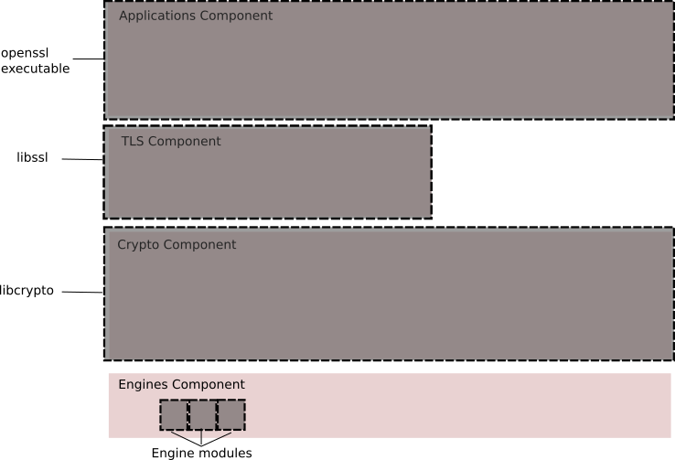

# OpenSSL

[https://www.openssl.org/docs/OpenSSLStrategicArchitecture.html](https://www.openssl.org/docs/OpenSSLStrategicArchitecture.html)

*   최신 안정 버전&#x20;

    * 2026년 9월 7일까지 지원되는 3.0 시리즈&#x20;
      * LTS버전&#x20;
    * 이전 LTS 버전(1.1.1 시리즈)도 사용할 수 있음&#x20;
      * 2023년 9월 11일까지 지원됨&#x20;
      * 모든 이전 버전은 지원X

#### As-is 아키텍처&#x20;

* 현재 OpenSSL은 네 가지 주요 구성 요소로 나뉨&#x20;

#### 1. libcrypto

* 수 많은 암호화 primitives 구현을 제공하기 위한 핵심 라이브러리&#x20;
* 또한 libssl 및 libcrypto에서 사용되는 일련의 지원 서비스와 CMS 및 OCSP와 같은 프로토콜 구현을 제공&#x20;

#### 2. Engine

* libcrypto의 기능은 Engine API를 통해 확장할 수 있음&#x20;
*   일반적으로, Engine은 libcrypto에 등록되고 사용 가능한 hook를 사용하여 암호화 알고리즘 구현을 제공하는 동적으로 로드 가능한 모듈&#x20;

    * 일반적으로 이들은 libcrypto에서 이미 제공한 알고리즘의 대체 구현
      * ex) 알고리즘의 하드웨어 가속 활성화
    * 그렇지만 기본 OpenSSL에서 구현되지 않은 알고리즘을 포함할 수도 있음&#x20;
      * ex) GOST 엔진은 GOST 알고리즘 제품군을 구현&#x20;

* 일부 엔진은 OpenSSL 배포의 일부로 제공되며 일부는 외부 제 3자(GOST)에서 제공&#x20;

#### 3. libssl

* 이 라이브러리는 libcrypto에 의존하며 TLS 및 DTLS 프로토콜을 구현&#x20;

#### 4. 응용 프로그램&#x20;

*   기본 libssl 및 libcrypto 구성 요소를 사용하여 다음과 같은 암호화 및 기타 기능 집합을 제공하는 명령줄 도구 집합&#x20;

    * 키 및 매개변수 생성 및 검사&#x20;
    * 인증서 생성 및 검사&#x20;
    * SSL/TLS 테스트 도구&#x20;
    * ASN.1 검사&#x20;
    * 등등&#x20;

#### 현재 OpenSSL의 특징&#x20;

* EVP (Envelope) API 레벨은 구체적인 구현 바인딩과 별도로 암호화 기능에 대한 상위 레벨 추상 인터페이스를 제공&#x20;
* EVP 계층 이외의 인터페이스를 통해 구체적인 암호화 알고리즘 구현을 직접 사용하는 것은 권장되지 않음&#x20;
* EVP 계층은 서명 및 확인과 같은 복합 작업도 제공&#x20;
*   특정 복합 작업은 EVP 수준 작업으로 제공됨&#x20;

    * ex) HMAC-SHA256

* EVP는 또한 알고리즘에 구애받지 않는 방식으로 암호화 알고리즘을 사용할 수 있음&#x20;
  * ex) EVP\_DigestSign은 RSA 및 ECDSA 알고리즘 모두에서 작동함&#x20;

* FIPS140은 지원되지 않음&#x20;

#### 개념적인 컴포넌트 View

* 기존 아키텍처는 하단에 암호화 계층이 있는 단순한 4레벨 계층&#x20;
* TLS 계층은 암호화 계층에 의존하고 애플리케이션은 TLS와 암호화 계층 모두에 의존&#x20;
  * diagram에 있다고해서 구성 요소가 공용 PI이거나 최종 사용자가 직접 액세스해서 사용할 수 있음을 나타내지 않음&#x20;

#### 패키지 View

*   위에서 설명한 구성 요소는 라이브러리(libcrypto 및 libssl) 및 관련 엔진 인터페이스와 다양한 응용 프로그램을 실행하기 위해&#x20;

    * 실행 가능한 openssl 명령줄로 패키징됨&#x20;

<figure><figcaption></figcaption></figure>

