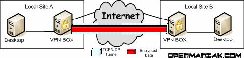
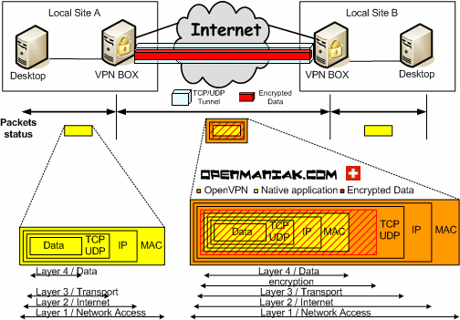

# OpenVPN

*   참고&#x20;

    [https://openmaniak.com/openvpn.php](https://openmaniak.com/openvpn.php)

* PSK

<figure><figcaption></figcaption></figure>

* 인터넷과 같은 보안되지 않은 네트워크를 통해 단일 TCP/UDP 포트를 통해 데이터를 안전하게 터널링하여 VPN을 설정하는 역할을 함&#x20;

* OpenVPN의 가장 큰 장점 : 설치 및 구성이 매우 쉽다는 것&#x20;
  * VPN을 만드는 데 사용되는 도구는 거의 없으니...
  * 거의 모든 플랫폼(Linux, Windows, OpenBSD, Mac OS X 등)

* OpenVPN은 클라이언트/서버 아키텍처를 기반으로 함&#x20;
  * 두 VPN 말단에 설치해야 하고, 하나는 서버, 다른 하나는 클라이언트로 지정됨&#x20;

#### 터널링&#x20;

* OpenVPN은 TCP, UDP 터널을 생성한 다음 터널 내부의 데이터를 암호화함&#x20;
* OpenVPN의 기본 포트 번호는 UDP, 1194
* IANA의 공식 포트 번호 할당을 기반으로 함&#x20;
* 다른 TCP 또는 UDP 포트를 사용할 수 있으며 2.0 릴리스부터 OpenVPN 서버의 여러 터널에 고유한 포트를 사용할 수 있음&#x20;

#### 보안 모드&#x20;

* 정적 키를 사용할 때 두 VPN 게이트웨이는 동일한 키를 공유하여 데이터를 암호화하고 해독&#x20;
  * 이 경우 구성은 매우 간단하지만, 문제는 터널의 다른 쪽에서 반드시 신뢰할 수 없는 사람에게 키를 제공해야 할 수도 있기 때문&#x20;
* 이 문제를 해결하기 위해 공개키 인프라(PKI)가 사용됨&#x20;
  * 각 당사자가 두 개의 키, 즉 모든 사람이 알고 있는 공개 키와, 비밀로 유지되는 개인 키를 소유한다는 사실에 기반&#x20;
  * 이 프로세스는 OpenVPN에 포함된 무료 오픈소스 SSL 버전인 OpenSSL에서 데이터 암호화를 진행하기 전에 VPN 피어를 인증하는 데 사용됨&#x20;

#### 두 방식의 장점을 비교&#x20;

| OpenVPN mode             | Pre-shared Keys | SSL                  |
| ------------------------ | --------------- | -------------------- |
| Cryptography mode        | Symmetric       | Asymmetric/Symmetric |
| Implementation           | Easier          | Harder               |
| Speed                    | Quicker         | Slower               |
| CPU consumption          | Smaller         | Higher               |
| Key exchange             | YES             | NO                   |
| Encryption Keys renewal  | NO              | YES                  |
| Peers authentication     | NO              | YES                  |

#### Bridging/Routing

* 각각 TAP 또는 TUN 네트워크 드라이버를 사용하여 이더넷(브릿지) 또는 IP(라우팅) VPN을 구축하도록 선택할 수 있음&#x20;
* TAP/TUN은 모든 플랫폼에서 사용할 수 있고, Linux 2.4 커널 이상과 함께 번들로 제공&#x20;
* OpenVPN 옵션은 특히 중요&#x20;

#### SSL&#x20;

* 수년 동안 IPSec은 site-to-site 또는 client-to-server VPN을 보호하는 데 사용할 수 있는 유일한 보안프로토콜이었음&#x20;
* 초기 SSL와는 달리 모든 애플리케이션을 보호하고, TCP 또는 UDP 터널을 암호화하여 사이트 간 클라이언트 간 VPN을 생성할 수 있음&#x20;
* SSL(Security Socket Layer)
  * TLS로 이름이 바뀜&#x20;
  * SSL 단어는 일반적으로 SSL 및 TLS 프로토콜을 모두 지정하는 데 사용됨&#x20;
* SSL의 주요 목표&#x20;
  * PKI(Public Key Infrastructrue)를 사용하여 서버와 클라이언트를 인증&#x20;
  * 클라이언트와 서버가 메시지를 교환할 수 있도록 암호화된 연결을 제공&#x20;

* SSL은 애플리케이션과 전송 계층 사이에 있으며 애플리케이션 계층을 암호화함&#x20;

#### SSL/TLS 단계

* 총 4가지&#x20;
* SSL Handshake : 데이터 전송 중에 사용할 Cipher Suite 협상
* SSL Change Cipher Spec : 클라이언트와 서버 간에 세션 키 설정 및 공유&#x20;
* SSL Alert : 클라이언트와 서버 간에 SSL 오류 메시지 전달&#x20;
* SSL Record : 데이터 전송&#x20;

#### VPN 원리&#x20;

* Virtual Private Network&#x20;
* 보안되지 않은 네트워크(일반적으로 인터넷)를 통해 두 장치 사이의 암호화된 터널을 지정하는 데 사용되는 약어&#x20;
* VPN 장치 뒤에 있는 두 개의 로컬 네트워크를 함께 그룹화하여 고유한 사설 네트워크를 생성&#x20;
* VPN이라는 단어 : 사이트 간 및 클라이언트 대 서버 보안 링크에 사용할 수 있음&#x20;
  * ex) OpenVPN을 사용해 사이트 간 VPN을 생성하는 것&#x20;

* VPN이 안전한 것으로 간주되려면?

#### 1. 기밀성 or Privacy

* 데이터를 읽을 수 있는 형식으로 볼 수 없음&#x20;
* 일반적인 대칭 암호 알고리즘
  * DES, 3DES, AES, Blowfish

#### 2. 진실성&#x20;

* 데이터는 변경할 수 없음&#x20;
* 일반적인 해시 함수 알고리즘&#x20;
  * SHA1, MD5

#### 3. 입증&#x20;

* VPN 게이트웨이는 상대방의 신원을 확신&#x20;
* 일반적인 알고리즘&#x20;
  * RSA, DH

* LAN 및 VPN 내부를 이동할 때 패킷 상태를 제공&#x20;

<figure><figcaption></figcaption></figure>

#### OpenVPN

* 암호화 및 인증 작업을 위해 OpenSSL이라는 SSL의 무료 오픈소스 버전을 사용&#x20;
* Openssl은 SSL 라이브러리, 암호화 라이브러리, Command Line 도구로 이루어진 도구&#x20;
* 암호화 라이브러리는 광범위한 암호화 알고리즘을 구현&#x20;
  * 대칭 알고리즘 : Blowfish, DES, 3DES, AES
  * 인증서 : x509
  * 해시 함수: HMAC, MD5

#### IPSEC - SSL 비교

* SSL과 IPSEC의 목표는 동일&#x20;
* 즉, VPN을 만들고 동일한 알고리즘으로 두 장치 간의 트래픽을 암호화함&#x20;
  * 이 작업을 수행하는 방법은 매우 다름&#x20;
  * IPSec, SSL은 호환되지 않음&#x20;

|                   | IPSEC              | SSL                                      |
| ----------------- | ------------------ | ---------------------------------------- |
| RFC               | 2401               | 4346                                     |
| OSI position      | Internet Layer     | Between Transport and Application Layers |
| Software location | Kernel Space       | User space                               |
| Installation      | Vendor non-specifc | Vendor specific                          |
| Configuration     | Complex            | Simple                                   |
| NAT               | Problematic        | No problem                               |
| Firewall          | Not friendly       | Friendly                                 |
| Interoperability  | YES                | NO                                       |
|                   |                    |                                          |

#### 세부 사항&#x20;

* IPSec : Layer 3 프로토콜, 구현하려면 IPSec 장치 커널 공간에서 IP 스택을 수정해야 함&#x20;
  * 이러한 커널 관련 변경 사항으로 인해 각 운영 체제(Cisco, Windows, Nortel, Linux 등)에는 고유한 IPSec 구현이 필요함&#x20;
* OpenVPN은 훨씬 더 표준 애플리케이션처럼 작동함&#x20;
  * 사용자 공간에서 구현되므로 훨씬 더 안전하고 portable할 수 있는 이점 존재&#x20;

#### 세부사항 1 : 보안

* 소프트웨어가 커널과 밀접하게 연결된 IPSec의 경우 응용 프로그램 충돌이 커널과 전체 시스템을 손상시킬 수 있음
  * OpenVPN은 커널과 완전히 분리되어 있기 때문에 문제가 없음&#x20;
* 소프트웨어 해킹의 경우 IPSec을 사용하면 해커가 커널 액세스(루트 액세스)를 얻을 수 있다는 것&#x20;
  * OpenVPN을 사용하면 특정 사용자가 제한된 권한으로만 애플리케이션을 실행함&#x20;

#### 세부사항 2 : Portable&#x20;

* OpenVPN은 거의 모든 플랫폼에 설치할 수 있기 때문에 Portable이 가능&#x20;
  * 따라서 항상 동일한 소프트웨어를 구성해야 함 =>  시간을 절약할 수 있음&#x20;

* IPSec의 매우 일반적인 문제&#x20;
  * 프로토콜 및 주소 변환(NAT) 처리를 허용하기 위해 방화벽 규칙을 변경해야 한다는 것&#x20;
  * NAT 통과 프로토콜에 의해 부분적으로 해결됨&#x20;

* OpenVPN을 사용하면 아직 열려있지 않은 경우 방화벽에서 TCP 또는 UDP 포트를 열면 됨&#x20;
  * OpenVPN은 프록시 서버를 통해서도 작동할 수 있음&#x20;
    * 방화벽이 전혀 변경되지 않음&#x20;
* IP Layer는 SSL에 의해 수정되지 않음&#x20;
  * NAT 프로토콜에는 문제가 없음&#x20;

* 사이트 간 SSL 터널을 구축하는 것은 IPSec보다 훨씬 더 간단&#x20;
  * IPSec 구성의 복잡성으로 인해 네트워크 관리자가 구축한 경우에도 종종 보안 허점 또는 구성 누락이 발생&#x20;
  * 또한, IPSec 구성은 제조업체마다 항상 다르지만 SSL 및 OpenVPN의 구성은 모든 시스템에서 매우 유사&#x20;

*   IPSec의 가장 큰 장점&#x20;

    * RFC를 지원하는 모든 제조업체에서 가상으로 사용할 수 있다는 것&#x20;
    * ex) Cisco와 Nortel 라우터 간에 VPN 설정 가능&#x20;
    * 일반적으로 서로 다른 제조업체가 IPSec 표준을 준수해야 하는 경우에도 시간이 지남에 따라 호환성 문제가 남아 있는 경우가 존재&#x20;

