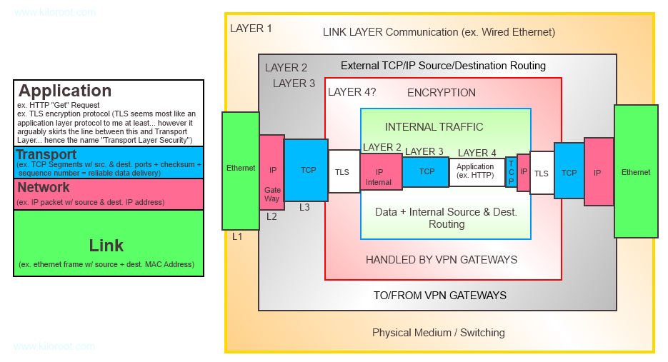

# How-VPN-Encapsulation



### VPN이 실제로 어떻게 작동하는지&#x20;

#### 계층화 및 캡슐화&#x20;

* 인터넷 통신의 전체 전제는 계층화 및 캡슐화 개념에 의존&#x20;
  * 핵심 아이디어 : 어떤 의미에서는 서로 독립적인 프로토콜 또는 기술의 4개의 계층 스택이 있지만, 각각은 아래 계층에서 "서비스"를 받고 상위 계층에서 "서비스"를 제공
  * 이것이 수행되는 방식은 부분적으로 캡슐화 개념을 통해 이루어짐&#x20;
* 종단 간 통신 중에 각 계층은 상위 계층을 둘러쌈&#x20;
  * 캡슐화&#x20;
  * 또한, 각 레이어는 상위 레이어가 올바르게 작동하는지 여부에 관계없이 정의된 "작업"을 수행&#x20;

* ex) 우편 서비스
  * 영어로 편지를 쓰고, 주소가 적힌 봉투에 넣음&#x20;
  * 이것을 우체국 직원이 픽업헤, 우편 시스템을 통해 전달됨&#x20;
  * 받는 사람에게 배달되고, 받는 사람은 편지를 열어서 읽음&#x20;
  * 만약 받는 사람이 영어를 못한다면?&#x20;
    * 우편 시스템이 편지를 배달하지 못하는가?&#x20;
    * 아님! 여전히 우편 시스템을 통해 진행되어 배송됨&#x20;
* 즉, 상위 계층에서 잘못 수행되는 작업은 하위 서비스 계층의 기능에 영향을 미치지 않음&#x20;
* 우체국이 모든 우체국 직원을 비행 로봇으로 교체하기로 결정하면 어떻게 될까?
  * 이것이 편지의 내용을 변경하는가?
  * 이것이 편지가 우편 네트워크를 통해 전달될 때 다른 경로를 거쳐야 함을 의미?
  * 아님. 우편 서비스의 "계층"은 위 또는 아래 계층에 반드시 영향을 주지 않고 독립적으로 변경할 수 있다는 의미&#x20;

* 캡슐화를 예로...
  * 편지가 봉투에 담겨 있음, 봉투는 우편 직원이 픽업하여 특정 우편 번호로 발송되는 모든 우편물이 들어 있는 상자에 넣고 상자는 우편 트럭에 보관됨&#x20;
  * 트럭은 상자가 하역되는 유통 센터로 이동한 다음, 상자의 우편 번호에 따라 다른 유통 센터로 전달됨&#x20;
    * 여기에서 편지가 들어있는 봉투가 있는 상자를 다른 트럭에 실음&#x20;
  * 그런 다음 트렁크는 우편 직원이 상자에서 봉투를 꺼내 받는 사람에게 배달하는 특정 주소로 이동&#x20;
  * 그런 다음, 수신자는 봉투를 열고 편지를 읽음&#x20;
  * 각 Layer는 그 안에 있는 다른 레이어를 캡슐화함&#x20;
  * 트럭(유통망의 일부)에는 편지가 들어있는 봉투가 들어있는 상자가 들어 있음&#x20;

#### VPN은 어떻게 작동?

* VPN에는 "캡슐화 내 캡슐화" + 원격 호스트 또는 위치에서 네트워크에 대한 논리적 "로컬" 연결을 달성하기 위한 암호화가 포함됨

<figure><figcaption></figcaption></figure>

#### Layer 4 : Application Layer&#x20;

* HTTP, FTP

#### Layer 3 : Transport Layer&#x20;

* TCP, UDP + Port

#### Layer 2 : Network Layer&#x20;

* IP

#### Layer 1 : Link Layer&#x20;

* physical medium + MAC addresses

* 비 VPN 네트워크 트래픽의 경우 한 번의 캡슐화 "round"만 볼 수 있음&#x20;
* ex) 유선(Link 계층)을 통해 전송되는 이더넷 프레임(Link 계층) 내에 캡슐화된 IP 패킷(네트워크 계층) 내에 캡슐화된 TCP 세그먼트(전송 계층) 내에 캡슐화된 HTTP Get 요청(애플리케이션 계층)

* 그러나, VPN은 우리가 다른 네트워크와 통신하고 있기 때문에 흥미로운 작업을 수행하지만&#x20;
  * 트래픽이 동일한 네트워크에 있는 것처럼 논리적으로 만들고 싶음&#x20;
  * 로컬 대상 네트워크를 위한 것&#x20;
* 그런 다음 TLS를 사용하여 이 모든 정보를 암호화한 다음 다른 전송 계층 및 네트워크에 모두 패키징(캡슐화)하기 시작하는 VPN 게이트웨이(컴퓨터의 VPN 클라이언트)로 이를 보냄&#x20;
* 이 모든 정보를 대상 네트워크 VPN 게이트웨이로 라우팅하기 위한 목적의 계층&#x20;
  * 이 모든 것은 Link 계층에 의해 캡술화됨&#x20;
  * 대상 VPN 게이트웨이 도착하면 TLS 암호화 데이터로 "압축 해제"(해독)된 다음 &#x20;
  * 암호화되지 않은 네트워크 계층(TCP 계층 및 애플리케이션 계층 데이터 포함)이 대상 네트워크를 통해 정상적으로 라우팅 됨 (다른 로컬 트래픽)
* 내부 전송, 네트워크 및 응용 프로그램 계층이 모두 대상 네트워크용으로 패키지되었기 때문에 논리적으로 모두 로컬인 것처럼 보임&#x20;

* 또한, 이 트래픽이 공용 네트워크(ISP 네트워크 또는 로컬 커피숍 Wi-Fi 네트워크 등)를 통과할 때 "중간"에서 "가로채기"할 수 있는 사람은 소스 및 대상 VPN 게이트웨이 주소를 볼 수 있지만,
  * 그 이상은 이 모든 것이 TLS를 통해 암호화되기 때문에 실제 소스 및 대상 클라이언트/호스트에 대한 정보나 이들 간에 교환되는 데이터에 대한 정보가 없음&#x20;

