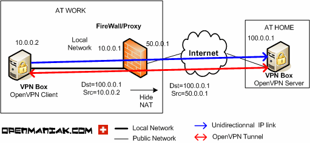

# OpenVPN tutorial

* [https://openmaniak.com/openvpn\_tutorial.php](https://openmaniak.com/openvpn\_tutorial.php)

#### 클라이언트/서버 아키텍처&#x20;

* 두 개의 OpenVPN에서 하나는 서버로, 다른 하나는 클라이언트로 선언해야 함&#x20;
* SSL VPN을 설정하기 전에 클라이언트는 먼저 특정 포트에서 서버에 도달하지만&#x20;
  * 서버는 클라이언트에 도달할 필요가 없음&#x20;
*   만약 내가 고유한 환경에 있고 인터넷에 직접 연결된 장치로 VPN을 설정하려면?

    * 대부분, 클라이언트는 서버에 도달할 수 있지만 반대는 도달할 수 없음&#x20;
    * 이는 클라이언트가 로컬 네트워크에 있고 프록시 또는 방화벽을 통해 인터넷에 도달하기 때문&#x20;
      * 자체 IP 주소 또는 소스 IP 주소를 다른 IP주소 (Hide NAT)로 대체하기 때문&#x20;

* 그럼에도 불구하고 터널이 만들어지면 그 내부의 양방향 통행은 당연히 가능

<figure><figcaption></figcaption></figure>

#### 인증서 및 공개키&#x20;

* 각 장치에는 개인 및 공개 키가 있어야 하고
  * 공개키는 인증서에 포함됨&#x20;
  * CA(인증 기관) 인증서도 각 OpenVPN 장치에서 소유해야 함&#x20;

#### DH(Diffie-Hellmann) 설정&#x20;

* OpenVPN 피어가 서로의 신원을 확인하면 DH를 사용해 해시 함수 및 암호화 알고리즘에 대한 Shared Secret을 생성할 수 있음&#x20;
* DH 개인 키를 다른 OpenVPN Box 공개 키와 결합해 두 OpenVPN 피어만 알고 있는 공유 비밀을 계산할 수 있음&#x20;
* 이 DH Shared Secret은 OpenVPN 사전 공유 키와 비교할 수 있음&#x20;
  * 이러한 키는 대칭 암호 및 해시 함수 알고리즘에서 사용됨&#x20;

#### 암호화 알고리즘&#x20;

* 기밀성은 3DES or AES와 같은 대칭 암호로 보장되어 데이터가 읽히지 않도록 보호함&#x20;

