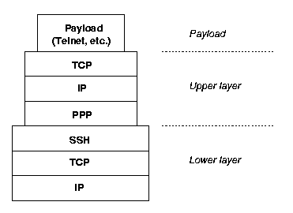

# TCP over TCP is A Bad idea?

* [http://sites.inka.de/\~W1011/devel/tcp-tcp.html](http://sites.inka.de/\~W1011/devel/tcp-tcp.html)

* IP 터널링 응용 프로그램에 대해 자주 발생하는 아이디어는 PPP와 같은 프로토콜을 실행하는 것&#x20;
* PPP는 TCP 기반 연결을 통해 스트림 전송(ex-모뎀 회선)에 적합한 형식으로 IP 패킷을 캡슐화함&#x20;
  * SSH를 통해 PPP를 실행하여 터널을 암호화하기 위한 쉬운 솔루션이 될 것&#x20;
  * 임의의 IP 트래픽을 압축하는 쉬운 방법이 될 수 있지만 데이터그램 기반 압축은 효율성 한계를 극복하기 어려움&#x20;

* 불행히도 잘 작동하지 않음, 긴 지연과 빈번한 연결 중단이 예상됨&#x20;

#### why? TCP의 재전송 알고리즘

* TCP는 데이터 스트림을 개별 IP 데이터그램으로 전송되는 세그먼트로 나눔&#x20;
* 세그먼트는 스트림의 바이트에 번호를 매기는 시퀀스 번호와 상대방에게 마지막으로 수신한 시퀀스 번호를 알려주는 확인 번호를 전달&#x20;
* IP 데이터그램은 손실, 복제 또는 재정렬될 수 있으므로 시퀀스 번호를 사용해 스트림을 재조립함&#x20;
* 확인번호는 세그먼트가 손실되었는지 간접적으로 보낸 사람에게 알려줌&#x20;
* 최근에 보낸 세그먼트에 대한 확인이 특정 시간 내에 도착하지 않으면 보낸 사람은 손실된 패킷을 가정하고 해당 세그먼트를 다시 보냄&#x20;

* 비교적 고정된 대역폭을 가진 회선을 통해 사용하도록 주로 설계된 유사한 접근 방식을 사용하는 다른 많은 프로토콜은 "특정 시간"을 고정하거나 구성할 수 있음&#x20;
  * 그러나 인터넷에서는 대역폭, 지연 및 손실률과 같은 매개변수가 연결마다 크게 다르며 단일 연결에서 시간이 지남에 따라 변경되기도 함&#x20;
* 초 범위의 고정된 시간 초과는 고속 LAN에서 부적절하고 마찬가지로 혼잡한 국제 링크에서도 부적절함&#x20;
  * 정체를 증가시키고, meltdown으로 알려진 효과로 이어질 것&#x20;

* 이러한 이유로 TCP는 모든 타이밍 관련 매개변수에 대해 적응형 시간 제한을 사용함&#x20;
  * 보수적인 추정치에서 시작해 수신된 모든 세그먼트에 따라 동적으로 변경됨&#x20;
  * 중요한 사항 - 세그먼트가 시간 초과되면 다음 시간 초과가 증가함&#x20;
    * 실제로 멜트다운 효과를 방지하는 것으로 나타났기 때문에 기하급수적으로 증가

#### TCP Stacking

* TCP 시간 제한 정책은 다양한 연결 특성에 대해 인터넷에서 제대로 작동함&#x20;
* TCP는 연결을 끊지 않으려고 매우 열심히 노력하기 때문에 제한 시간이 몇 분 범위까지 늘어날 수 있음&#x20;
  * 무인 대량 데이터 전송에 적합
  * 대화형 응용 프로그램의 경우 이러한 느린 연결은 당연히 바람직하지 않으며, 사용자가 연결을 종료할 가능성이 높음&#x20;

* 안정성을 위한 이 최적화는 하나의 TCP 연결을 다른 TCP 연결 위에 쌓을 때 깨짐&#x20;
  * TCP 설계자가 전혀 예상하지 못한 것&#x20;
* 그러나 SSH나 다른 TCP 기반 프로토콜을 통해 PPP를 실행할 때 발생함&#x20;
* PPP로 캡슐화된 IP 데이터그램이 다음과 같이 TCP 기반 페이로드를 전달한 가능성이 높기 때문&#x20;

<figure><figcaption></figcaption></figure>

* 상위 및 하위 계층 TCP에는 서로 다른 타이머가 있음&#x20;
* 상위 계층 연결이 빠르게 시작되면 타이머도 빠름&#x20;
  * 이제 낮은 연결의 타이머가 더 느려질 수 있음&#x20;
  * 아마도 느리거나 신뢰할 수 없는 기본 연결이 있는 기간에서 남은 시간일 수 있음&#x20;

* 이러한 상황에서, 기본 연결이 패킷 손실을 시작하면 어떤 일이 발생하는지 상상해보자&#x20;
* 하위 계층 TCP는 재전송을 대기하고 시간 제한을 늘림&#x20;
  * 이 시간 동안 연결이 차단되기 때문에 상위 계층(즉, 페이로드) TCP는 적시에 ACK를 받지 못하고 재전송을 대기열에 넣음&#x20;

* 시간 초과가 여전히 하위 계층 시간 초과보다 작기 때문에 상위 계층은 하위 계층이 처리할 수 있는 것보다 더 빨리 더 많은 재전송을 대기열에 넣음&#x20;
  * 상위 계층 연결이 매우 빠르게 중단되고 모든 재전송이 내부 멜트다운 효과라는 문제에 추가됨&#x20;

* TCP의 안정성 프로비저닝은 여기서 역효과를 냄&#x20;
  * 반송파가 전송을 보장하기 때문에 상위 계층 재전송은 완전히 불필요함&#x20;
  * 그러나 TCP는 항상 신뢰할 수 없는 반송파라고 가정하기 때문에 상위 계층 TCP는 이를 알 수 없음&#x20;

* [http://sites.inka.de/\~bigred/devel/cipe.html](http://sites.inka.de/\~bigred/devel/cipe.html)

