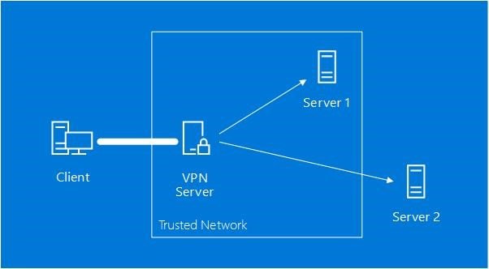

# PQCrypto-VPN

* [https://github.com/microsoft/PQCrypto-VPN](https://github.com/microsoft/PQCrypto-VPN)
* [https://www.microsoft.com/en-us/research/project/post-quantum-crypto-vpn/](https://www.microsoft.com/en-us/research/project/post-quantum-crypto-vpn/)

#### 양자 이후 암호화 및 VPN

* 인터넷을 통해 은행, Facebook 또는 거의 모든 온라인에 보안 연결을 할 때마다 암호화는 통신을 안전하게 유지&#x20;
  * 이러한 암호화 중 일부는 양자 컴퓨터로 해결할 수 있는 것으로 알려진 수학적 문제를 기반으로 함&#x20;
  * 양자 컴퓨터에서 작업하는 과학자들이 계속 발전함에 따라 암호 작성자도 작업에 참여하여&#x20;
  * 양자 공격에 저항할 수 있는 수학적 문제를 기반으로 새로운 양자 이후 암호 시스템을 개발 중&#x20;

* 때가 되면 서비스 및 애플리케이션의 통신을 포함해, 모든 네트워크 트래픽을 새로운 양자 이후 암호화로 Migration하는 것은 시간이 많이 걸리고 긴 프로세스가 될 것&#x20;
  * 오늘날의 공개키 암호화를 깨뜨릴 수 있는 충분히 강력하고 안정적인 양자 컴퓨터가 실행되기까지는 5년 이상이 걸릴 것이라고 함&#x20;

*   전 세계의 다른 연구팀과 MS가 새로운 암호 시스템을 개발하며 실제 프로토콜 및 응용 프로그램과 어떻게 작동하는지 테스트 중&#x20;

    * Post-Quantum 암호화의 가장 중요한 시나리오 중 하나 => VPN

* VPN : 인터넷의 두 지점 사이에 보안 링크를 설정하고 애플리케이션이 마치 동일한 네트워크에 있는 것처럼 내부에서 실행할 수 있도록 함&#x20;
* 미래에 NIST Post-Quantum 프로젝트와 같은 노력으로 Post Quantum 암호 시스템이 검증되면&#x20;
  * Post Quantum 암호화로 보호되는 VPN을 신속하게 배포하여 기존 애플리케이션을 보호할 수 있음&#x20;

#### Post-Quantum Crypto VPN Software

* OpenVPN SW를 fork해, Post-Quantum 암호화와 결합
* 아직은 실험용이고, 민감한 데이터나 통신을 보호하는 데 사용해서는 안 됨&#x20;
* 추가 암호 분석 및 연구가 먼저 수행되어야 함&#x20;
* 현재 Release
  * 트래픽이 클라이언트와 서버 사이의 VPN 터널을 통과할 떄만 양자 컴퓨터의 공격으로부터 트래픽을 보호함&#x20;

<figure><figcaption></figcaption></figure>

* Client와 Server1 사이의 트래픽에는 Post-Quantum 보호 기능이 있음&#x20;
* Server1 : VPN 서버와 동일한 신뢰할 수 있는 네트워크에 있기 때문&#x20;
* Client와 Server 2 사이의 트래픽에는 Post-Quantum 보호 기능이 없음&#x20;
* 트래픽이 VPN 서버를 빠져나간 후 조직의 자체 내부 네트워크 또는 신뢰할 수 있는 클라우드 공급자 내에 있는 통신이 보호됨&#x20;

### Post-Quantum 암호화 프로젝트의 일환&#x20;

* Microsoft Research Security and Cryptography의 후원을 받음&#x20;
* 학계 및 업계 협력자와 함께 알고리즘을 설계&#x20;

#### Frodo : 학습 오류 문제에 기반한 키 교환 프로토콜&#x20;

#### SIDH : Supersingular Isogeny Diffie-Hellman 기반 키 교환 프로토콜&#x20;

#### Picnic : 대칭 키 프리미티브 및 비대화형 영지식 증명을 사용하는 서명 알고리즘&#x20;

#### qTESLA: 오류가 있는 링 학습 기반 서명 알고리즘 문제&#x20;

* 다른 암호화 제품군을 작동시킬 수 있는 만큼 활성화할 것&#x20;
  * OpenVPN 포크 => OpenSSL의 Open Quantum Safe 프로젝트 포크에 의존
    * 새로운 알고리즘에 대한 지원을 추가하려는 기여자는
    * Open Quantum Safe에서 지원되는지 확인해야 함&#x20;

