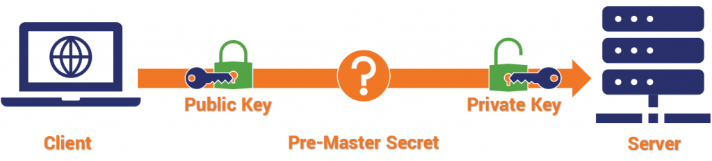

# TLS v1.2 vs  TLS v1.3

* [https://www.a10networks.com/glossary/key-differences-between-tls-1-2-and-tls-1-3/](https://www.a10networks.com/glossary/key-differences-between-tls-1-2-and-tls-1-3/)

#### TLS(전송계층보안)

* 온라인 개인 정보 보호를 위한 기본 기술&#x20;
  * 암호화 프로토콜인 TLS(Transport Layer Security)
  * HTTPS&#x20;
    * HTTP를 통해 인터넷을 통해 데이터를 이동할 때 데이터를 암호화하고 연결을 인증함&#x20;
* 사용자가 웹사이트를 방문하면 브라우저가 사이트에서 TLS 인증서를 확인
  * 존재하는 경우 브라우저는 TLS Handshake를 수행하여 유효성을 확인하고 서버를 인증함&#x20;
* 두 서버 간에 링크가 설정되면 TLS 암호화 및 SSL 암호 해독을 통해 안전한 데이터 전송이 가능&#x20;

#### TLSv1.2 vs TLSv1.3

* 이전 버전에 비해 몇 가지 향상된 기능을 제공
  * 특히 더 빠른 TLS Handshake와 더 간단하고 안전한 암호화 제품군을 제공&#x20;
  * 0-RTT 키 교환은 TLS Handshake를 더욱 간소화함&#x20;

#### 더 빠른 TLS Handshake&#x20;

* TLS 암호화 및 SSL 암호 해독에는 CPU 시간이 필요하고 네트워크 통신에 대기 시간이 추가되어 성능이 다소 저하됨&#x20;
* TLSv1.2에서 초기 handshake가 일반 텍스트로 수행되었으므로 암호화 및 암호 해독이 필요했음&#x20;
* 일반적인 Handshake에 클라이언트와 서버 간에 교환되는 5\~7개의 패킷이 포함된다는 점을 감안&#x20;
  * 연결에 상당한 오버헤드를 추가했음&#x20;
* v1.3에서는 기본적으로 서버 인증서 암호화가 채택되어 TLS Handshake가 0\~3개의 패킷으로 수행될 수 있음
  * 이 오버헤드를 줄이거나 제거하고 더 빠르고 응답성이 높은 연결을 허용함&#x20;

#### 더 간단하고 강력한 암호 제품군&#x20;

* v1.3은 TLS 핸드셰이크 중에 교환할 패킷 수를 줄이는 것 외에도 암호화에 사용되는 암호 제품군의 크기도 줄였음&#x20;
* TLSv1.2 및 이전 버전에서 암호화 취약점이 있는 암호를 사용하면 잠재적인 보안 취약점이 발생했음&#x20;
* TLSv1.3은 PFS(Perfect Forward Secrecy)를 지원하지 않는 알고리즘을 포함하여 현재 알려진 취약성이 없는 알고리즘에 대한 지원만 포함&#x20;
* 이 업데이트는 이미 TLS 연결이 있는 클라이언트와 서버가 새 매개 변수를 협상하고 새 키를 생성할 수 있는 재협상(renegotitation)을 수행하는 기능도 제거했음&#x20;
  * 이 기능은 위험을 증가시킬 수 있음&#x20;

#### Zero Round-Trip Time (제로 왕복 시간)

* SSL과 마찬가지로 TLS는 키 교환에 의존하여 보안 세션을 설정&#x20;
* 이전 버전에서는 정적 RSA 키 또는 Diffie-Hellman 키의 두 가지 메커니즘 중 하나를 사용하여 핸드셰이크 중에 키를 교환할 수 있음&#x20;
* TLSv1.3에서는 임시 Diffie-Hellman 키를 유지하면서 모든 정적(비 PFS) 키 교환과 함께 RSA가 제거되었음&#x20;
  * 불법적으로 액세스할 경우 보안을 손상시킬 수 있는 정적 키로 인한 보안 위험을 제거하는 것 외에도&#x20;
  * Diffie-Hellman 계열에만 의존하면 클라이언트가 "hello" 중에 키 생성에 필요한 필수 무작위 및 입력을 보낼 수 있음&#x20;
* 핸드셰이크에서 전체 왕복을 제거함으로써 시간을 절약하고 전반적인 사이트 성능을 향상시킴&#x20;
  * 또한 이전에 방문한 사이트에 액세스할 때 클라이언트는 이전 세션의 사전 공유 키(PSK)를 활용하여&#x20;
  * 첫 번째 메시지의 데이터를 서버로 보낼 수 있으므로 "왕복 시간이 0"(0-RTT)

\------

[https://www.thesslstore.com/blog/tls-1-3-everything-possibly-needed-know/](https://www.thesslstore.com/blog/tls-1-3-everything-possibly-needed-know/)

* 기술적으로 TLS 1.3은 SSL/TLS 프로토콜의  7번째 버전&#x20;
  * SSL과 TLS 사이에는 몇 가지 기술적인 차이가 있었음&#x20;
    * 처음에는 연결이 포트에서 시작되었는지 또는 프로토콜에서 시작되었는지 여부&#x20;
    * 그러나 전제는 대체로 동일했음&#x20;

#### TLSv1.3 : 10년 간의 제작&#x20;

* TLSv1.2 이후 10년 만에 출시되었음 28개의 초안을 거쳐 최종적으로 정의됨&#x20;

#### TLSv1.2와의 차이점&#x20;

* 오래된 알고리즘 및 암호에 대한 지원 제거&#x20;
* RSA 키 교환을 제거하고 PFS(Perfect Forward Secrecy)를 요구&#x20;
* 핸드셰이크에서 협상 횟수를 줄임&#x20;
* 암호 제품군의 알고리즘 수를 2로 줄임&#x20;
* 블록 모드 암호를 제거하고 AEAD 대량 암호화를 의무화함&#x20;
* HKDF 암호화 추출 및 키 파생 사용&#x20;
* 1-RTT 모드 및 제로 왕복 재개 제공&#x20;
* TLSv1.2의 개선인 전체 핸드셰이크에 서명&#x20;
* 추가적인 타원곡선 암호를 지원&#x20;

TLSv1.3은 취약한 알고리즘 및 암호를 제거했음&#x20;

* 시간은 모든 암호 시스템의 적&#x20;
* 시간이 지남에 따라 주어진 알고리즘이나 암호 시스템을 잠재적 위험으로 만드는 취약점과 악용이 발견됨&#x20;
* TLSv1.3은 이론적으로나 실질적으로 취약한 알고리즘과 암호에 대한 지원을 제거했음&#x20;
* 역사적으로 handShake 후 HTTPS 연결 중에 사용될 보안 세션 키를 교환하기 위한 두 가지 인기 있는 메커니즘이 있었음&#x20;
  * RSA, Diffie-Hellman&#x20;

* RSA는 공개 키 암호화를 사용하여 세션 키를 생성하는 데 사용되는 pre-master-secret과 client-random을 교환

<figure><figcaption></figcaption></figure>

* Diffie-Hellman은 클라이언트와 서버가 세션키라는 값에 상호 도달하는 방법&#x20;

<figure><figcaption></figcaption></figure>

* RSA 키 교환에는 Oracle 패딩 공격과 같은 문제가 있음&#x20;
* RSA에 대한 또 다른 노크는 임시 키 모드를 제공하지 않는다는 것&#x20;
  * 이는 Pefect Forward Secrecy에 필요&#x20;
* 순방향 보안이 없으면 누군가 암호화된 대화를 저장하고 개인 키를 손상시키는 경우 해당 세션을 해독할 수 있음&#x20;
  * Heartbleed가 개인 키의 도난 허용?
* Forward secrecy는 이를 방지 => TLSv1.3에서 의무화&#x20;
* 다른 이점은 RSA가 키 교환 옵션에서 제거되었기 때문에&#x20;
  * TLS 핸드셰이크를 시작하는 클라이언트는 자신이 Diffie-Hellman 계열이 될 것임을 알고&#x20;
    * "hello"하는 동안 , 키 생성에 필요한 필수 랜덤 및 입력을 전송하여 "추측"할 수 있다는 것&#x20;
* 핸드셰이크의 전체 왕복을 효과적으로 제거하여 소요 시간을 줄이고 웹 사이트의 전반적인 성능을 향상시킴&#x20;

*   HTTPS 연결 초기에 클라이언트와 서버는 SSL/TLS 핸드셰이크를 수행&#x20;

    * TLSv1.2에서는 Handshake를 완료하기 위해 양쪽에서 두 번의 왕복이 필요&#x20;

    <figure><figcaption></figcaption></figure>
* TLS 1.3에서는 단 한 번의 왕복으로 줄었음&#x20;
  * Negotiations이 네 번에서 두 번으로 줄었기 때문&#x20;
*   키 교환 및 확장된 디지털 서명 체계는 더 이상 협상이 필요하지 않음&#x20;

* 짧은 TLS 핸드셰이크는 사이트에 대한 연결이 더 빨라지고 대기 시간이 짧아진다는 것을 의미&#x20;

<figure><figcaption></figcaption></figure>

* 차이는 밀리초 단위로, 그러나 규모가 커지면 합산됨&#x20;
  * 기업이 항상 TLSv1.3이 달성하는 네트워크 성능을 개선할 방법을 찾고 있음&#x20;

* TLSv1.3을 더 빠르게 만드는 또 다른 기능
  * 제로 왕복 시간 재개(0-RTT)
  * 이 기능을 사용하면 최근에 귀하의 사이트를 방문한 사람을 위해 거의 즉각적인 세션 재개가 가능함&#x20;
  * 모바일 네트워크에서 대규모로 이러한 속도 변화는 꽤 눈에 띔

* TLSv1.2에는 연결을 재개하는 몇 가지 방법인 세션 ID와 세션 티켓이 있음&#x20;
  * 이는 TLSv1.3에서 사전 공유 키로 결합되었음&#x20;
  * 클라이언트와 서버가 연결 중에 사용할 세션 키를 생성하는 것과 마찬가지로 일단 연결이 설정되면&#x20;
    * 유사한 기능을 사용하여 0-RTT를 용이하게 하는 "Resumption master key"를 생성할 수 있음&#x20;

*   클라이언트와 서버가 세션을 다시 시작하려는 경우 세션 티켓과 함께 전송되는 서버의 일부 애플리케이션 데이터를 암호화하는 데 Resumption master key가 사용됨&#x20;

    * 서버가 유효성을 검사하고 세션이 다시 시작됨&#x20;

#### AEAD 대량 암호화&#x20;

* 대량 암호화는 대칭 암호화를 나타내는 또 다른 방법&#x20;
* 전통적으로 이를 처리하는 두 가지 방법&#x20;
  * 블록, 스트림&#x20;
* Block 암호에는 모든 종류의 알려진 문제가 있음&#x20;
  * TLSv1.3에서 사라졌음&#x20;
* 스트림 모드에서 실행하기만 하면 되는 블록 암호를 계속 사용할 수 있음&#x20;
* 가장 큰 차이점은 블록 모드 암호가 고정 길이 블록으로 암호화된다는 것&#x20;
  * 어떤 경우에는 패딩이 필요하지만, 바람직하지 않음&#x20;

* 이름이 적절하게 적용되는 스트림 암호는 임의 길이의 유사 무작위 데이터 스트림을 생성&#x20;
  * TLSv1.3에 새로운 부분이 추가됨&#x20;
* 암호화와 인증이 단일 요소로 결합되었음&#x20;
  * 메시지 인증은 항상 SSL/TLS의 일부&#x20;
  * 그렇지 않으면 암호화된 악성 패킷을 연결에 삽입하기가 너무 쉬울 것&#x20;

* 역사적으로는 이 두 가지는 분리되었음&#x20;
  * 이 새로운 유형의 대칭 구성을 AEAD(추가 데이터 포함 인증 암호화)라고 함&#x20;

* AEAD는 인증된 암호화의 변형&#x20;
  * 일반적으로 AE에 대해 허용되는 몇 가지 접근 방식이 존재&#x20;

#### Encrypt-then-MAC(EtM)

* MAC은 메시지 인증 코드를 나타냄&#x20;
* 이 접근 방식에선 먼저 일반 텍스트를 암호화한 다음 해당 암호문을 기반으로 하는 해시 함수를 통해 MAC을 생성한 다음 둘을 함께 보냄&#x20;
* MAC이 적절한 수준의 엔트로피를 가지고 있음을 의미&#x20;
  * 강력하게 위조할 수 없는 조건을 제공하는 가장 강력한 방법&#x20;

<figure><figcaption></figcaption></figure>

#### Encrypt-and-MAC(E\&M)

* Encrypt-AND-MAC은 일반 텍스트(여전히 해시 함수임)에서 MAC을 파생하며 일반 텍스트는 MAC 없이 암호화되고 MAC과 암호문이 함께 전송됨&#x20;

<figure><figcaption></figcaption></figure>

#### MAC-then-Encrypt (MtE)

* 일반 텍스트를 사용하여 MAC을 생성한 다음 MAC과 일반 텍스트를 함께 암호화하여 전달함&#x20;

<figure><figcaption></figcaption></figure>

#### MAC-and-Cheese (Mmm)

#### 간소화된 암호 제품군&#x20;

* 이제 협상의 절반이 핸드셰이크에서 제거되었음 => 암호 그룹의 크기도 축소되었음&#x20;

<figure><figcaption></figcaption></figure>

* TLSv1.2및 이전 버전은 4개의 암호를 포함하는 암호 제품군을 사용함&#x20;
* TLSv1.3에서 암호 제품군에는 더 이상 키 교환 및 서명 알고리즘이 포함되지 않음&#x20;
  * 대량 암호와 해싱 알고리즘

<figure><figcaption></figcaption></figure>

* TLSv1.2의 가장 큰 문제 중 하나는 가능한 암호 조합의 수를 수십 개로 끌어올린 약어 수프&#x20;
  * 지원해야 할 암호화 제품군에 대한 지침이 거의 없는 선택지가 너무 많았기 때문에..
* TLSv1.3에서는 권장되는 암호화 제품군이 5개뿐인 지점까지 상당히 축소&#x20;
  * TLS\_AES\_256\_GCM\_SHA384
  * TLS\_CHACHA20\_POLY1305\_SHA256
  * TLS\_AES\_128\_GCM\_SHA256
  * TLS\_AES\_128\_CCM\_8\_SHA256
  * TLS\_AES\_128\_CCM\_SHA256

