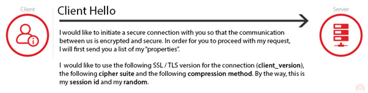

# TLS Security

* [https://www.acunetix.com/blog/articles/establishing-tls-ssl-connection-part-5/](https://www.acunetix.com/blog/articles/establishing-tls-ssl-connection-part-5/)

* 보안 SSL/TLS 연결을 설정하는 프로세스에는 여러 단계가 포함됨&#x20;
* SSL/TLS 보안 프로토콜은 비대칭 및 대칭 암호화의 조합을 사용함&#x20;
* 클라이언트와 서버는 사용되는 알고리즘을 협상하고 키 정보를 교환해야 함&#x20;
* TLS 1.2에서 사용된 프로세스는 SSL/TLS의 모든 이전 버전에서 거의 동일했음&#x20;
  * 그러나 최신 버전의 Transport Layer Security에서는 크게 단순화함&#x20;

* 보안 연결 설정의 가장 중요한 부분&#x20;
  * 바로 **핸드셰이크**
*   TLS 핸드셰이크 중에 서버와 클라이언트는 연결 속성을 결정하는 데 사용되는 중요한 정보를 교환&#x20;

<figure><figcaption></figcaption></figure>

* 먼저, 클라이언트는 Client Hello를 서버로 보냅니다.
  * Client Hello에는 다음 정보가 포함됨

#### Client Version

* 클라이언트는 지원하는 모든 SSL/TLS 프로토콜 버전 목록을 보내며 선호하는 버전이 목록의 첫 번째가 됨&#x20;
  * 선호하는 것은 일반적으로 사용 가능한 최신 버전&#x20;

#### Client Random

* 32바이트 난수
* 클라이언트 임의 및 서버 임의는 나중에 암호화용 키를 생성하는 데 사용됨&#x20;
* 원래 TLS 1.2 사양에서 처음 4바이트는 클라이언트의 현재 날짜 및 시간(epoch 형식)을 나타내고 나머지 28바이트는 임의로 생성된 숫자로 간주되었음&#x20;
  * 그러나 IETF는 나중에 이를 반대할 것을 권장&#x20;

#### Session ID

* 연결에 사용할 세션 ID
* session\_id가 비어 있지 않으면 서버는 이전에 캐시된 세션을 검색하고&#x20;
  * 일치하는 항목이 있으면 해당 세션을 다시 시작함&#x20;

#### 압축 방법(Compression\_methods)&#x20;

* SSL 패킷을 압축하는 데 사용할 방법&#x20;
* 입축을 사용하면 대역폭 사용량을 줄일 수 있으므로 전송 속도가 빨라짐&#x20;
  * 압축을 사용하는 것이 위험한 이유를 살펴봅시다

#### Cipher Suites&#x20;

* 암호 제품군은 암호화 알고리즘의 조합&#x20;
* 각 암호 제품군에는 키 교환, 인증, 대량(데이터) 암호화 및 메시지 인증과 같은 각 작업에 대해 하나의 암호화 알고리즘이 포함되어 있음&#x20;
* 클라이언트는 선호하는 순서대로 지원하는 모든 암호화 제품군 목록을 보냄&#x20;
  * 클라이언트가 전송된 첫 번째 암호 그룹을 사용하여 설정되는 연결을 이상적으로 선호한다는 것을 의미&#x20;

* 암호 그룹은 문자열로 식별됨&#x20;
  * **TLS\_ECDHE\_ECDSA\_WITH\_AES\_128\_GCM\_SHA256**
* **TLS :** 사용중인 프로토콜&#x20;
* **ECDHE :** 키 교환 알고리즘 (타원 곡선 Diffie-Hellman)
* **ECDSA :** 인증 알고리즘
  * **Elliptic Curve Digital Signature Algorithm**
* **AES\_128\_GCM :** 데이터 암호화 알고리즘&#x20;
  * Advanced Encryption Standard 128 bit Galois/Counter Mode&#x20;
* **SHA256** : 메시지 인증 코드(MAC) 알고리즘&#x20;
  * Secure Hash Algorithm 256

#### 압축 알고리즘&#x20;

* 데이터 압축(암호화 전)에 사용할 방법 목록&#x20;
* 압축을 사용하면 대역폭&#x20;

