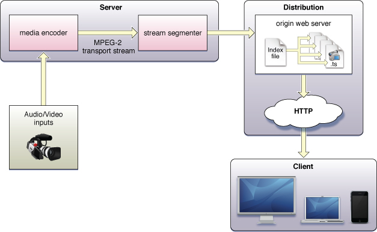
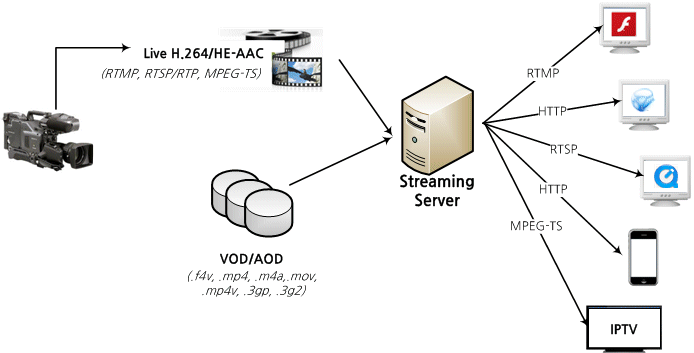

# HLS & Adaptive

#### HLS

* HTTP 라이브 스트리밍&#x20;
* 가장 널리 사용되는 비디오 스트리밍 프로토콜&#x20;
* 주문형 스트리밍이자 동시에 라이브 스트리밍입니다&#x20;
* 비디오 파일을 다운로드할 수 있는 HTTP 파일 조각으로 나누고 HTTP 프로토콜을 이용하여 전송합니다&#x20;
* 장점 중 하나 : 모든 인터넷 연결 장치가 HTTP를 지원하기 때문에 전용 서버가 필요한 스트리밍 프로토콜보다 간단하게 실행할 수 있다는 것&#x20;
* 또 다른 장점&#x20;
  * HLS 스트리밍 - 재생에 지장을 주지 않고 네트워크 상태에 따라 비디오 품질을 높이거나 낮출 수 있다는 것&#x20;
  * 사용자가 비디오를 보는 중에 품질이 나빠지거나 좋아질 수 있음&#x20;
  * 적응 비트 전송률 스트리밍&#x20;
  * 이 기능이 없으면 네트워크가 느려진 경우 비디오 재생이 완전히 멈출 수 있음&#x20;

#### 스트리밍&#x20;

* 인터넷을 통해 사용자에게 비디오 및 오디오 미디어를 전달하는 방법&#x20;
* 미디어 파일을 한 번에 모두 보내는 대신, 한 번에 조금씩 지속적으로 사용자 장치에 보냄&#x20;
* 원본 미디어 파일은 멀리 떨어진 곳에 저장되어 있거나 라이브 스트리밍의 경우 원격 카메라, 마이크를 이용하여 실시간으로 제작됨&#x20;
  * 따라서, 사용자의 장치가 먼저 모든 파일을 다운로드하지 않고 비디오 또는 오디오를 재생할 수 있음&#x20;

#### HTTP

* 네트워크에 연결된 장치 사이에 정보를 전송하기 위한 애플리케이션 계층 프로토콜&#x20;
* HTTP를 통한 스트리밍의 경우 표준 요청, 응답 패턴이 적용되지 않음&#x20;
  * 클라이언트와 서버 사이의 연결은 스트리밍 기간 동안 열려있고 서버는 비디오 데이터를 클라이언트에 보내기 때문에&#x20;
    * 클라이언트는 비디오 데이터 세그먼트마다 요청하지 않아도 됨&#x20;

#### RTSP

* 라이브 스트리밍을 위한 전통적인 프로토콜
* 도입 비용이 높고 방화벽 환경에서 서비스가 원활하게 이루어지지 않는 단점이 존재&#x20;
  * 단점 : HTTP를 라이브 스트리밍을 위한 프로토콜로 사용하는 방법이 나오게 됨&#x20;

#### HTTP를 사용하는 라이브 스트리밍&#x20;

*   동영상 라이브 스트리밍 : Live Streaming&#x20;

    * 텔레비전 생방송처럼 촬영한 정보를 실시간으로 사용자의 동영상 플레이어로 보내 재생하도록 하는 방식&#x20;

#### HLS와 기존 라이브 스트리밍 방식과의 비교&#x20;

* HLS와 기존 라이브 스트리밍 방식 모두 동영상을 끊김 없이 사용자의 동영상 플레이어에 전달한다는 점에서는 동일한 구조&#x20;

1. '동영상 정보를 전달하는 방식'
2. HLS에서 만든 stream segment

<figure><figcaption></figcaption></figure>

<figure><figcaption></figcaption></figure>

* HLS에서 서버는 HTTP로 요청을 받아서 플레이어에 응답을 주는 역할만 함&#x20;
* 요청받은 파일을 읽어서 어떠한 변형도 하지 않고, 읽은 그대로 응답에 포함해 보내기만 한다.&#x20;
  * 즉, 저장되어 있는 파일을 읽어서 HTTP 응답에 데이터를 실어서 보낼 수 있는 웹 서버면 어떤 웹 서버든 사용할 수 있음&#x20;

* Stream Segmenter&#x20;
  * 일정한 시간 간격마다 입력받은 미디어 데이터를 분할해 파일을 만들고, 그 분할한 파일에 접근할 수 있는 메타데이터(m3u8)를 생성하는 일
* HTTP는 양방향 방식이 아니기 때문에, 클라이언트에서 반드시 서버에 요청을 해야 그에 맞는 응답을 받을 수 있음&#x20;
  * 즉, 잘게 쪼갠 동영상과 다음에 볼 동영상 정보를 함께 클라이언트에 전달하고 동영상이 끊김 없이 때에 맞춰 다음 동영상 정보를 요청

* Stream Segmenter - 동영상 데이터를 변형하지 않으므로 기능이 복잡하지 않음&#x20;
  * HLS는 일반 웹 서비스의 구조와 같은 방식을 사용하기 때문에 전체적으로 볼 때 단순해졌다고 할 수 있음&#x20;

#### 동영상 압축&#x20;

* RGB를 이용하는 표현법 = 널리 쓰고 있는 색 표현법&#x20;
* 빨강, 초록, 파랑의 밝기 값을 각각 0\~255의 숫자로 표현하는 방법&#x20;
* 0\~255의 숫자를 컴퓨터에서 이용하는 이진 데이터로 만들면 8비트의 저장 공간이 필요
  * RGB 방식으로 색을 표현할 때는 3바이트가 필요&#x20;

* 3바이트로는 픽셀이라고 부르는 1개 화소의 색만 표현
  * 전체 화면에 대한 정보를 보내려면 화면 크기만큼 화소의 색깔 정보가 있어야 함&#x20;
* 해상도가 VGA(640\*480)인 영상의 경우엔 30만 7천 2백 개의 화소가 있으므로 데이터는 총 921,600바이트가 됨&#x20;
  * 움직이는 화면에서 초당 약 30개의 화면을 보낸다고 하면 초당 27MB라는 어마어마한 데이터를 보내야 함&#x20;
* 해상도가 더 높은 영상은 당연히 데이터의 양이 많아지므로 동영상 압축이 필요&#x20;

* m3u8 포맷을 이해하기 전에 m3u 포맷을 먼저 알아야 함&#x20;
  * m3u 포맷 : 연속으로 재생할 MP3 파일 목록을 가진 플레이 리스트 파일&#x20;
    * 각 줄마다 재생할 파일의 경로를 적는 매우 단순한 구조&#x20;
  * m3u에는 Latin-1 문자 집합만 적을 수 있음
    * 단순히 파일 목록을 나열할 뿐이므로 재생할 파일에 대한 정보를 재생하기 전에 미리 알 수 없음&#x20;

* 확장 규격이 m3u8 포맷이 나옴&#x20;
  * m3u8 포맷에선 UTF-8 문자 집합을 사용할 수 있고, 여러 가지 지시어로 재생할 파일에 대한 추가적인 정보를 제공할 수도 있음&#x20;
  *

[https://d2.naver.com/helloworld/7122](https://d2.naver.com/helloworld/7122)

* HLS
  * [https://developer.apple.com/streaming/](https://developer.apple.com/streaming/)
  * [https://www.cloudflare.com/ko-kr/learning/video/what-is-http-live-streaming/](https://www.cloudflare.com/ko-kr/learning/video/what-is-http-live-streaming/)
  * [https://www.netmanias.com/ko/?m=view\&id=blog\&no=5867](https://www.netmanias.com/ko/?m=view\&id=blog\&no=5867)

* [https://www.netmanias.com/ko/?m=view\&id=blog\&no=5867](https://www.netmanias.com/ko/?m=view\&id=blog\&no=5867)
